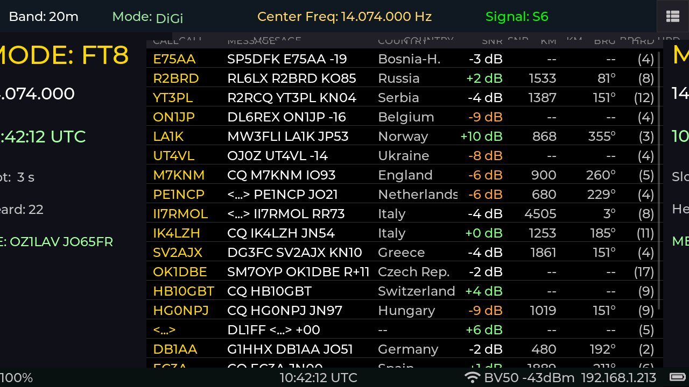

# QMX+ Panadapter

*By Steffen Lav (OZ1LAV).*

A standalone real-time panadapter — spectrum analyzer and waterfall — for the [QRP Labs QMX/QMX+](https://www.qrp-labs.com/qmxp.html) HF transceiver, running on the [M5Stack Tab5](https://docs.m5stack.com/en/core/tab5) (ESP32-P4 with a 5" 720×1280 touch display).

The QMX exposes I/Q audio over USB UAC plus CAT control over USB CDC-ACM. The Tab5 connects to the QMX as a USB host, decodes the I/Q in real time on the ESP32-P4, and renders a touch-driven panadapter with tap-to-tune.


*The panadapter live on hardware in flat-spectrum mode (new in v0.9.2): 48 kHz of spectrum centered on the QMX VFO (14.074 MHz, 20m FT8). The spectrum trace tracks a per-bin noise floor and renders dB-above-floor, so noise collapses to a calm baseline and real signals (here the FT8 pile-up around 14.074) pop sharp above it. Thermal-palette waterfall below uses matching colour and floor maths. Top status bar: band, mode, centre freq, S-meter. Bottom bar: battery, WiFi RSSI, IP. The same view streams live to any browser on the LAN via the web UI — see [Quick start: web UI](#quick-start-web-ui) below.*

## Hardware setup

The panadapter needs two USB connections:

```
┌──────────────┐    USB-A → USB-C    ┌─────────────┐
│              │ ──────────────────► │             │
│  M5Stack     │   (UAC + CDC-ACM)   │   QMX+      │
│  Tab5        │                     │             │
│              │                     └─────────────┘
│              │
│              │    USB-C → USB-C/A  ┌─────────────┐
│              │ ──────────────────► │   Laptop    │
└──────────────┘  (power + dev UART) └─────────────┘
```

- **Tab5 USB-A → QMX+ USB-C** — Tab5 acts as the USB host. The QMX+ exposes itself as a UAC audio class device (I/Q audio) and a CDC-ACM serial port (CAT control). The Tab5 talks to both simultaneously.

- **Tab5 USB-C → laptop** — provides power to the Tab5 (and charge the battery if present) and gives you a serial console at 115200 baud for the boot log, plus the dev USB-JTAG channel for flashing.

You can run the panadapter standalone once it's flashed — just power the Tab5 from any USB-C source (5V/2A or better) or the internal battery if present. The laptop is only needed for flashing, debugging, or capturing screenshots.

## Reporting hardware issues

The M5Stack Tab5 ships in at least two hardware variants that look identical from the outside. This firmware currently supports the **ST7123 panel + ST7123 touch** variant (Tab5 v1.3 ECO2). If the panadapter doesn't work on your unit — display stays blank, frequency stuck at default, web UI shows "disconnected" — please flash the latest release and capture the boot log.

Near the top of the log you'll see a block like:

```
I (xxxx) bsp_info: === TAB5 BSP INFO ===
I (xxxx) bsp_info: chip:     ESP32-P4 rev v1.3
I (xxxx) bsp_info: psram:    30 MB
I (xxxx) bsp_info: panel:    ST7123 (inferred from touch)
I (xxxx) bsp_info: touch:    ST7123 @ 0x55
I (xxxx) bsp_info: heap:     230.5 kB internal free, 28.80 MB PSRAM free
I (xxxx) bsp_info: idf:      v5.4.4
I (xxxx) bsp_info: firmware: v0.9.3
I (xxxx) bsp_info: =====================
```

Open an [issue](https://github.com/SteffenLav/qmx-panadapter/issues) with this block pasted in. The `panel` and `touch` lines tell us which hardware revision you have, which is the first thing we need to know.

### History

The original mockup that drove the design ([panadapter-mockup-ideal.svg](docs/panadapter-mockup-ideal.svg)) and the first real-world screenshot from v0.7 ([QMX-Panadapter_1st_snapshot.png](docs/QMX-Panadapter_1st_snapshot.png)) are kept in `docs/` for reference. The design notes including the expected hardware artifacts (DC spike, I/Q image) live in [docs/panadapter-display-design.md](docs/panadapter-display-design.md).

---

## Status

Working. All phases through 8 complete, plus cold-boot reliability fix, I/Q balance correction (Phases A-C), WiFi STA with on-screen credential entry, web UI (v0.9.0), flat-spectrum mode (v0.9.2), hardware-revision diagnostics (v0.9.3), persistent settings + DiGi label (v0.9.4), full radio-state parity in the browser (v0.9.5), Hamlib rigctld network CAT bridge (v0.9.6), DSP cleanup (v0.9.7), waterfall jump fix (v0.9.8), persistence + polish pass (v0.9.9), trivial-debt cleanup (v0.9.9.1), onboard FT8 RX (v0.10.0-beta1), WiFi modal hotfix (v0.10.0-beta2), and LVGL pool migration to PSRAM (v0.10.0-beta3).

| Phase | What | Status |
|-------|------|--------|
| 1     | LVGL UI on Tab5 ST7123 display | done |
| 2     | USB Host CDC-ACM, CAT poll, frequency display | done |
| 3     | USB UAC audio streaming + ring buffer + DSP consumer | done |
| 4     | esp-dsp FFT (1024-pt complex, Blackman-Harris) at 48 frames/s | done |
| 5.1   | Real-time spectrum line graph @ 10 Hz | done |
| 5.2   | Waterfall with classic SDR gradient + moving-pointer scroll | done |
| 5.3   | Label band, offset ticks, dB grid | done |
| 5.4   | EMA spectrum smoothing + autoscaling dB range (superseded by 5.5) | done |
| 5.5   | Static dB range (manual Ref/Range convention), correct 24-bit scaling | done |
| 5.6   | One-pole IIR DC blocker on the I/Q stream before FFT | done |
| 5.7   | Polling audio_task on core 0 + drain loop — fixes noise-floor pumping | done |
| 5.8   | dBm calibration scale anchored on QMX dummy load | done |
| 5.9   | Larger fonts + continuous green spectrum curve + dim fill | done |
| 5.10A | CAT mode polling (alternating FA / MD; 5 Hz each) | done |
| 5.10B | Band derivation from QMX frequency | done |
| 5.10C | Real frequency axis labels (absolute MHz centered on VFO) | done |
| 5.10D | Top-bar layout, S-meter, settings drawer with presets and sliders | done |
| 5.10E | 12 kHz IF offset compensation (signals centered on VFO) | done |
| 5.10F | Waterfall auto-floor tracking + mode-aware tune snap | done |
| 5.10G | Passband indicator from CAT FW (with mode defaults) | done |
| 5.10H | Faster CAT poll + optimistic touch-to-tune UI | done |
| 5.10I | Bigger burger and close buttons (80x80) | done |
| 5.10J | Auto-enable QMX IQ mode (`Q9 1;`) on CAT connect | done |
| 5.11  | Hidden long-press screenshot to UART (top-left 80x80) | done |
| 6.1   | Touch-to-tune via CAT FA, live cyan drag cursor | done |
| 6.2   | Landscape rotation 1280×720 (LVGL software rotation) | done |
| —     | Cold-boot fix (PI4IO expander init for LCD_RST / TP_RST) | done |
| A     | I/Q balance correction (Gram-Schmidt blind adaptive, hardcoded ON) | done |
| B     | I/Q balance ON/OFF toggle in settings drawer | done |
| C     | I/Q balance time constant tuning (two-speed convergence) | done |
| 7.1   | Phase 1 web UI: HTTP status page and /api/status JSON (v0.9.0) | done |
| 7.2   | Phase 2 web UI: binary /ws WebSocket spectrum streaming at ~10 fps (v0.9.0) | done |
| 7.3   | Phase 3 web UI: browser waterfall with auto-tracking thermal palette (v0.9.0) | done |
| 7.4   | Unified Tab5 + browser visual identity (palette, floor maths, curve) (v0.9.0) | done |
| 7.5   | Screenshot mutex fix — hold display lock blocking during snapshot (v0.9.1) | done |
| 8     | Flat-spectrum mode (per-bin tracked floor; drawer toggle + NVS) (v0.9.2) | done |
| —     | NVS settings persistence (dB range, EMA alpha, IQ toggle) | done |
| —     | WiFi STA via esp_hosted + SNTP UTC sync | done |
| —     | On-screen WiFi credential modal (SSID/password in NVS) | done |
| -     | `bsp_info_log()` boot diagnostics for Tab5 panel/touch identification (v0.9.3) | done |
| -     | Persistent settings partition `user_nvs` surviving merged.bin reflash (v0.9.4) | done |
| -     | Mode label rename: FSK to DiGi for soundcard digital modes (v0.9.4) | done |
| -     | Web UI: VFO + mode + band + S-meter parity with Tab5 top bar (v0.9.5) | done |
| -     | Web UI: centre marker + passband indicator + frequency axis labels (v0.9.5) | done |
| -     | /ws refactor: dedicated push task unblocks /api/status during streaming (v0.9.5) | done |
| -     | CAT setters: cat_set_mode() + cat_set_passband_hz() (v0.9.6) | done |
| -     | Hamlib rigctld TCP server on port 4532 (network CAT bridge) (v0.9.6) | done |
| -     | DSP cleanup: remove per-frame median sort (v0.9.7) | done |
| -     | Waterfall jump fix: 30 Hz -> 10 Hz render avoids LVGL flush cascade (v0.9.8) | done |
| -     | Persistence + polish: last-VFO, CW pitch, waterfall colour maps, snap-to-peak (v0.9.9) | done |
| -     | Trivial-debt cleanup: dynamic version, flat-mode label hide, mojibake fix (v0.9.9.1) | done |
| -     | Onboard FT8 RX decoder with DXCC, distance, bearing per call (v0.10.0-beta1) | beta |
| -     | Per-unit QMX IF calibration trim slider (v0.10.0-beta1) | beta |

See the [Roadmap](#roadmap) at the bottom for what's next.

---

## Hardware

- **M5Stack Tab5** with ESP32-P4 v1.3 (ECO2) silicon, ST7123 5" 720×1280 MIPI-DSI touch panel, 32 MB hex PSRAM, ESP32-C6 co-processor for WiFi
- **QRP Labs QMX or QMX+** transceiver (Kenwood-style CAT, UAC audio)
- USB-C OTG cable Tab5 ↔ QMX

## Software requirements

- **ESP-IDF v5.4.4** — pinned, because:
  - ESP32-P4 v1.3 silicon needs `CONFIG_ESP32P4_REV_MIN_0=y` and CPU capped at 360 MHz
  - The local M5Stack UserDemo BSP is built against this IDF version
- VS Code with the Espressif IDF extension (or any IDF-compatible setup)
- Windows 11 + PowerShell (other platforms work fine, just no `qmx` helper)

## Build, flash, monitor

Standard IDF flow:

    idf.py build flash monitor

Or via the helper function in `$PROFILE` (see Tools section below):

    qmx fm      # build + flash + monitor
    qmx b       # build only
    qmx m       # monitor only

Exit monitor with Ctrl+T then Ctrl+X.

## Quick start: web UI

Once the Tab5 is on WiFi (see [WiFi configuration](#wifi-configuration)), it serves both an HTTP status page and a live spectrum/waterfall WebSocket on port 80. Open the Tab5's IP address in any modern browser — the IP is shown in the bottom status bar and in the boot log.

### `/` — status + live spectrum

The landing page mirrors the device screen in real time: spectrum trace updates at ≈10 fps via WebSocket, full waterfall history (≈50 seconds, 512 rows) auto-tracks the noise floor and uses the same thermal palette as the device. Underneath, a live status card shows VFO, battery, WiFi RSSI and the Tab5's own IP.

### `/api/status` — polled status JSON

```json
{
  "battery": { "level": 100, "charging": true },
  "wifi":    { "ssid": "BV50", "rssi": -44, "ip": "192.168.1.213" },
  "freq_hz": 14074000
}
```

Polled by the landing page at 1 Hz; safe to consume from any other client (monitoring scripts, home automation, etc.).

### `/ws` — binary spectrum WebSocket

Single-client endpoint. Each binary frame is 1026 bytes:

| Bytes | Meaning |
|-------|---------|
| `0`   | Frame type: `0x01` = spectrum |
| `1`   | Reserved (always 0 for now) |
| `2–1025` | 1024 unsigned bytes, each one bin, quantised −130 dBm (q=0) to −30 dBm (q=255) |

Bins are pre-shifted server-side: byte 2 is the leftmost device pixel, byte 1025 the rightmost. The 12 kHz QMX IF offset is already applied, so the QMX dial frequency lands at the visual centre. Push rate is ~10 fps; a new connection refuses if a session is already active.

## Layout (landscape 1280 × 720)

    +----------------------------------------------------------+
    | Top bar (60 px)  freq | mode | s-meter | menu            |
    +----------------------------------------------------------+
    | Spectrum (200 px) green line + amber center + cyan touch |
    |                   + horizontal dB grid + live dB labels  |
    +----------------------------------------------------------+
    | Label band (18 px) -24k -12k 0 +12k +24k + tick marks    |
    +----------------------------------------------------------+
    | Waterfall (412 px) 1280 × 412, newest row at top         |
    |                    classic SDR gradient                  |
    +----------------------------------------------------------+
    | Bottom bar (30 px) status, span, fps                     |
    +----------------------------------------------------------+

## Touch-to-tune

- Touch anywhere on spectrum or waterfall → cyan cursor tracks your finger
- Drag to position → cursor follows live
- Lift -> CAT `FA` command sent; QMX retunes; spectrum re-centers on the tapped signal. Rounding is mode-aware (Phase 5.10F): USB/LSB snap to 500 Hz, CW to 10 Hz, FT8/digi to 100 Hz, AM/FM to 1 kHz
- Center cursor (amber, fixed at x=640) marks where the QMX is currently tuned

CAT writes are internally rate-limited to one per 200 ms; rapid taps within that window are dropped silently.


## Top bar, S-meter, settings drawer (Phase 5.10)

The top status bar reads `Band | Mode | Center Freq | Signal` left to right, with the frequency centered. Band and mode come from CAT (FA / MD / FW round-robin poll at 50 ms intervals = each field refreshes every ~150 ms). The band name is derived from the VFO frequency using widened ranges that cover the QMX's tunable region beyond the strict IARU edges. The Signal field shows S-units derived from `dsp_get_peak_dbm_around_vfo(64, ...)` (the peak dBm within +/-64 bins, about +/-3 kHz of the VFO) sampled at 5 Hz in the render task.

Under the spectrum, the frequency axis labels show absolute MHz centered on the VFO (e.g. `13.988 / 13.994 / 14.000 / 14.006 / 14.012` at 48 kHz span), refreshed on every CAT freq update.

**IF offset compensation (Phase 5.10E).** The QMX presents I/Q with a +12 kHz IF offset: the signal at the QMX dial frequency lands at +12 kHz in the baseband. Both `ui_push_spectrum` and `render_waterfall_tick` shift the displayed bin selection right by n_bins/4 so the tuned signal appears at the visual center under the amber VFO marker. Touch-to-tune math is unchanged because `s_last_qmx_freq_hz` is the dial reading, not the LO.

**Waterfall auto-floor (Phase 5.10F).** The waterfall's "darkest color" level is no longer fixed; it tracks the running median of the spectrum once per second (EMA-smoothed, alpha 0.3, clamped -150 to -30 dBm). The dark background therefore follows actual band conditions instead of a hard-coded -130 dBm anchor. The spectrum trace stays user-controlled via the settings drawer (manual ref/range like commercial SDRs).

**Mode-aware tune snap (Phase 5.10F).** Touch-to-tune rounding is mode-dependent: USB / LSB snap to 500 Hz (voice channel grid), CW to 10 Hz (precision), FT8 / digi / RTTY / FSK to 100 Hz, AM / FM to 1 kHz. The current mode is cached from CAT MD into `s_current_mode`.

**Passband indicator (Phase 5.10G).** Two 2-px-wide medium-grey vertical lines mark the QMX receiver's current passband edges. Width comes from CAT FW polling (the QMX returns real values: 300 Hz for CW, 2500 Hz for USB/LSB, 3200 Hz for FSK). Falls back to per-mode defaults if FW reports nothing. Passband geometry is mode-aware: CW/AM/FM are symmetric around the VFO, USB extends from VFO+200 Hz to VFO+200+width, LSB is the mirror, FT8/digi follows USB.

**Faster CAT + optimistic UI (Phase 5.10H).** CAT poll interval dropped from 200 ms to 50 ms so dial-spinning no longer skips. Touch-to-tune optimistically updates the on-screen frequency label immediately on a successful CAT write rather than waiting ~150 ms for the next FA poll to confirm.

**Settings drawer (Phase 5.10D / Phase B).** The burger button on the top right opens a 520 px right-side settings drawer with a 250 ms slide-in animation. Contents:
- **IQ Balance toggle** (Phase B) — ON/OFF switch wired to `iq_balance_set_enabled()`; re-enabling resets the estimator so it converges from a clean state
- **Presets** (HF Normal / HF DX / Strong Sig.) — each sets dB range and EMA smoothing in one tap
- **WiFi** button — opens the credential modal (see WiFi section below)
- **dB Range sliders** (Min and Max in dBm) — live updates `ui_set_db_range()`
- **Smoothing slider** (EMA alpha, 0.05 to 1.00) — live updates `render_set_ema_alpha()` (the formerly hard-coded `SMOOTH_ALPHA` is now a runtime variable)

**Bigger touch targets (Phase 5.10I).** The burger button is 80x80, parented to the screen so it overflows downward into the spectrum area without being clipped by the top bar. The drawer close X is also 80x80. Both icons use Montserrat 32 to fill the button size cleanly. A 200x120 deadzone in the top-right of the spectrum suppresses tunes that overlap the burger button.

## I/Q balance correction (Phases A–C)

The QMX presents I/Q audio over USB UAC with a small but measurable amplitude imbalance and quadrature error between the I and Q channels. Without correction, the result is an "image" of every signal mirrored across the center frequency — a strong signal 10 kHz above center also appears at 10 kHz below center, around 30 dB weaker. This clutters the waterfall and spectrum, especially on a busy band.

**Algorithm (Phase A).** A blind adaptive Gram-Schmidt orthogonaliser runs sample-by-sample in the audio pipeline, before the samples reach the FFT. It maintains running estimates of three statistics:
- **DC offset** on each channel (exponential moving average, τ = 1 s)
- **Power** in I and Q (τ = 200 ms)
- **Cross-product** I·Q (τ = 1 s) — the key signal: non-zero cross-product means the channels are not orthogonal

From these it computes per-sample correction coefficients (`K_phi`, `K_amp`) and applies:

    i_out = i
    q_out = (q - K_phi · i) × K_amp

No calibration step is needed. The estimator converges automatically on ambient band noise within a few seconds of receiving any signal.

**Time constant tuning (Phase C).** A two-speed scheme speeds up initial lock-in: for the first 2 s of real signal after each reset, all three estimators run at 8× their steady-state alpha, giving effective convergence in ~125 ms. After that they drop to their slow steady-state values for stable long-term tracking. The cross-product time constant was also halved (2 s → 1 s) for quicker steady-state response to slow phase drift.

**Toggle (Phase B).** The settings drawer has an IQ Balance ON/OFF switch. Turning it off freezes the estimator (coefficients are preserved but stop updating); turning it back on resets it so it reconverges from a clean state.

The DC spike at bin 0 (caused by a small ADC DC offset, present even with correction active) is separately handled by the one-pole IIR DC blocker in Phase 5.6.

## Spectrum smoothing, dB range, dBm calibration (Phase 5.5 / 5.7 / 5.8)

The spectrum is smoothed per bin with an exponential moving average (α = 0.4) before display, balancing visual stability against the snappy response needed to see real signals (CW, SSB attack).

The displayed dB range is fixed at -130 to -30 dBm, matching commercial SDR convention (HDSDR, SDR Console, Flex Maestro) where the user picks a manual Ref/Range rather than letting the display continuously rescale. Continuous autoscale was tried in Phase 5.4 and removed in 5.5 — it actively hid signal-vs-noise dynamics. The -130 dBm floor and -30 dBm ceiling cover the real signal range from quiet HF noise floor (anchored on dummy load in Phase 5.8) to S9+40 strong signals.

**dBm calibration (Phase 5.8).** The displayed dB values are calibrated against the QMX on a dummy load: with no antenna, the median dB across all bins per second is logged, and `DSP_DB_CALIBRATION_OFFSET` is set to `-130 - median` so the noise floor reads -130 dBm. On this hardware the measured offset is -148.0 dB. S-unit reference: S9 = -73 dBm, S5 ≈ -97 dBm, S1 ≈ -121 dBm. Signals stronger than ~S9+40 (-30 dBm) clip at the display ceiling but still indicate presence at full-scale.

**Continuous green curve (Phase 5.9).** Each column's trace is connected to the previous column's `y_top` with a bright vertical line, so the spectrum reads as a continuous curve rather than disconnected per-column dots. Below the curve, a dim ~25% green fill (RGB565 `0x01C0`) gives the look of [docs/panadapter-mockup-ideal.svg](docs/panadapter-mockup-ideal.svg). Grid lines at -120, -100, -80, -60, -40 dBm.

## WiFi configuration

The Tab5 connects to the local network through the on-board ESP32-C6 co-processor via [`esp_hosted`](https://github.com/espressif/esp-hosted) over SDIO. Once online, SNTP syncs UTC time. By itself this isn't visible to the user beyond a log line, but it satisfies the time-reference prerequisite for the upcoming onboard FT8 decoder and the web UI features that now live in v0.9.0+.

Credentials are entered through a full-screen LVGL modal launched from the **WiFi** button in the settings drawer.

- **SSID textarea** — pre-filled from NVS on each open, so you can see what's currently configured
- **Password textarea** — masked, always starts blank
- **On-screen keyboard** — appears when a textarea is focused; hides on the keyboard's close-icon or Enter
- **Save / Cancel** buttons

On **Save**, `panadapter_wifi_reconnect(ssid, pass)` is called. This:

1. Writes the new credentials to NVS (32-char SSID, 64-char WPA2 password limits)
2. Triggers a disconnect-then-reconnect cycle so the new SSID takes effect immediately
3. Closes the modal

If no credentials are configured at boot, WiFi stays idle (no retry storm) until the user opens the modal and saves something. Saving an empty SSID is silently ignored — Cancel discards changes and leaves NVS untouched.

**Why a runtime modal instead of build-time `wifi_credentials.h`.** Earlier versions kept SSID/password in a gitignored header. That made every WiFi change a rebuild-and-flash cycle, and required publishing build instructions to teach new users about the file. With the modal, a flashed binary is portable: the user enters their own network on first boot. Credentials are stored only in NVS, never embedded in the firmware image.

## Onboard FT8 (v0.10.0-beta1, RX-only)



*Live FT8 reception on 20 m at 14.074 MHz. Left pane: MODE / VFO / UTC / slot countdown / heard count / operator identity (callsign+grid). Right pane: scrollable decode list with CALL / MESSAGE / COUNTRY / SNR / KM / BRG / HRD columns. Country pulled from DXCC prefix lookup, KM and BRG computed great-circle from the operator's grid square to each decoded station's grid.*

Switch the panadapter into FT8 mode via the **Mode: FT8** button in the settings drawer. The Tab5 then decodes the 15-second FT8 slots directly on the ESP32-P4 with no PC required.

**What's shown.**
- **Left info pane** - large MODE / VFO / UTC / slot countdown, plus heard count and operator identity (callsign + grid loaded from NVS).
- **Right decode list** - scrollable table with columns CALL / MESSAGE / COUNTRY / SNR / KM / BRG / HRD:
  - CALL: extracted remote callsign (handles `CQ DX K1ABC`, `CQ POTA K1ABC`, and standard `<base> <call> <grid>` formats).
  - MESSAGE: full decoded FT8 message text.
  - COUNTRY: DXCC entity from prefix lookup (~190 entities, longest-prefix match, handles common /P /M suffixes).
  - SNR: rough proxy from decoder score, colour-banded (green >=0, white -5..-1, orange -15..-6, grey <-15). Not WSJT-X-equivalent dB yet.
  - KM / BRG: great-circle distance + bearing from your grid (set via the **Identity** button in the drawer) to the decoded station's grid.
  - HRD: count of times this call has been decoded since power-on.

**Set your callsign and grid first.** Drawer -> **Identity** -> enter callsign and 4 or 6-char Maidenhead grid. Values persist to NVS. Without a grid set, the KM and BRG columns show `--`.

**Performance.** On a busy 20 m FT8 slot the decoder regularly yields 25-50 callsigns per slot. Heap is stable across long sessions (39 KB internal RAM free, 25 MB PSRAM free during decoding).

**Known limitations (beta).**
- RX only. No TX yet -- that's v0.11.
- SNR is a coarse proxy from the LDPC decoder score, not a calibrated dB value relative to 2500 Hz noise BW like WSJT-X.
- No ADIF logging yet (v0.13).
- Mode switching between Panadapter and FT8 currently discards panadapter state (waterfall history, IQ balance estimator). Accepted trade-off for the simpler RX-only release.
- Long sessions (multi-hour) not yet soaked end-to-end -- please open an issue if you see reboots while in FT8 mode.

FT8 reception requires accurate UTC time, which the Tab5 gets from SNTP -- WiFi must be configured first.

## Per-unit IF calibration

QMX local oscillator trim varies slightly between units, so the +12 kHz IF injection isn't pixel-perfect 12000 Hz on every unit. If signals appear consistently shifted left or right of where the QMX is actually tuned, open the settings drawer and find the **IF calibration** slider (between CW Pitch and Waterfall colour map). Range +/-200 Hz in 10 Hz steps. Persisted to NVS. Default 0.

Reported by Ken (KF0AYY), whose unit needed about -55 Hz to land on centre.

## Related projects

- [DX-FT8](https://github.com/WB2CBA/DX-FT8-FT8-MULTIBAND-TABLET-TRANSCEIVER) by Barb (WB2CBA) - an open-hardware FT8 tablet transceiver. Inspiring reference for a similar use-case.
- [`qrp_companion`](https://groups.io/g/QRPLabs/topic/118645485) by Zhenxing Han (N6HAN) - Tab5 companion for QMX with audio + CAT. Source of several architectural ideas including the polling audio task pattern.
- [`ft8_lib`](https://github.com/kgoba/ft8_lib) by Karlis Goba - the FT8 encoder/decoder vendored in this project as `components/ft8_lib`.

## Project layout

    qmx-panadapter/
    |-- main/
    |   |-- main.c                  app_main, orchestration
    |   |-- display/                LVGL bring-up via local BSP
    |   |-- ui/                     LVGL widgets, touch handler, canvases, WiFi modal
    |   |-- cat/                    USB CDC-ACM + Kenwood CAT
    |   |-- audio/                  USB UAC + ring buffer
    |   |-- dsp/                    esp-dsp FFT, spectrum mutex, I/Q balance correction
    |   |-- render/                 10 Hz render task, smoothing, autoscale
    |   |-- screenshot/             Long-press capture, base64 UART stream
    |   |-- storage/                NVS settings persistence (dB, EMA, IQ, WiFi creds)
    |   |-- wifi/                   esp_hosted STA + SNTP
    |   `-- util/                   Status bar (battery + WiFi)
    |-- components/
    |   |-- m5stack_tab5/                  M5Stack local BSP (ST7123 panel + touch)
    |   `-- espressif__usb_host_uac/       Patched UAC component (see Quirks)
    |-- docs/
    |   |-- architecture.md                Overall signal path
    |   `-- panadapter-display-design.md   Display mockups + DC-spike / I/Q image notes
    `-- managed_components/         Other deps fetched via idf_component.yml

## Quirks and trade-offs (read this!)

A few decisions that matter and that someone (including future-me) will otherwise relearn the hard way.

### PI4IO expander must be initialized explicitly before display bring-up

The Tab5's PI4IO I/O expander holds `LCD_RST` and `TP_RST` low at chip power-on. The BSP's `bsp_display_start_with_config` does **not** call `bsp_io_expander_pi4ioe_init` internally. Without it, on a true cold boot the panel never comes out of reset, doesn't respond to DSI commands, and `esp_lcd_new_panel_io_dbi` hangs forever in the read FIFO wait loop.

Soft resets and USB-tethered development mask this entirely: the expander is a separate I²C peripheral that retains its state across ESP32 resets, so LCD_RST and TP_RST stay high from the previous boot.

Our `display_init` calls `bsp_i2c_init()` + `bsp_io_expander_pi4ioe_init(bsp_i2c_get_handle())` at the very start, then waits 120 ms for both chips to come out of reset before letting the BSP probe I²C for the touch controller. Without that delay, the probe runs too fast on cold boot, falls back to ILI9881C panel, then mismatches with the (now-responding) ST7123 touch chip and asserts.

### Patched UAC component lives in `components/`

`espressif/usb_host_uac` was hand-patched in Phase 3.2 to set `create_background_task = true` in `uac_host_install`. Without this, UAC and CDC-ACM cannot coexist on the same USB host on this hardware.

Because the component manager refuses to clean `managed_components/` after a hand-patch, the component was moved permanently to `components/espressif__usb_host_uac/`. **Trade-off:** no auto-updates from the registry. If you want to update it, fetch a fresh copy, re-apply the patch, and replace the directory.

### LVGL software rotation costs ~50% FPS

The ST7123 panel is natively portrait 720×1280 and does *not* implement `esp_lcd_panel_swap_xy`. To get landscape, we use `bsp_display_cfg.sw_rotate=1` plus `lv_display_set_rotation(disp, LV_DISPLAY_ROTATION_90)`.

LVGL rotates every flush in software (`rotate90_rgb565`). Real-world impact on this hardware: spectrum FPS drops from ~22 (portrait) to ~13 (landscape).

Acceptable for a panadapter — commercial radios in this class run 10–15 Hz waterfalls.

**PPA hardware rotation is not usable here.** The ESP32-P4 PPA driver (`CONFIG_LVGL_PORT_ENABLE_PPA`) conflicts with the USB host stack over DW-GDMA channels — enabling it silently breaks UAC and CDC-ACM, so the QMX appears disconnected. Do not set `CONFIG_LVGL_PORT_ENABLE_PPA=y`.

Phase 6.3 (FPS recovery) requires rendering directly in the panel's native 720×1280 portrait coordinates — all widget positions transposed, all canvas drawing code rewritten in portrait — so LVGL never has a rotation step to perform. This is a significant UI rewrite and has not been attempted yet.

### IDLE-task watchdog is disabled

LVGL's rotation pipeline keeps CPU0 busy long enough that the IDLE0 task can't reset its watchdog within the default 5 s. The system isn't actually hung — it just doesn't yield to IDLE. We:

- Disabled `CONFIG_ESP_TASK_WDT_CHECK_IDLE_TASK_CPU0/CPU1`
- Bumped `CONFIG_ESP_TASK_WDT_TIMEOUT_S` from 5 to 30 (safety net for genuinely stuck app tasks)

Real hangs in our app tasks will still be caught. Idle starvation under LVGL load won't generate noise.

### Engineering-sample silicon (ESP32-P4 v1.3)

- Use `CONFIG_ESP32P4_REV_MIN_0=y` (the build will fault `Illegal instruction` if revision is set too high)
- Cap CPU at 360 MHz (`CONFIG_ESP_DEFAULT_CPU_FREQ_MHZ=360`)
- Both already baked into `sdkconfig`

### Waterfall scroll trick

We allocate the waterfall canvas at 2× height (1280×824 RGB565). Each tick writes the new row at both `s_wf_head` and `s_wf_head + WATERFALL_H`, then decrements `s_wf_head` (with wrap). The canvas view pointer is moved through the buffer instead of `memmove`-ing. ~130 µs/tick instead of ~92 ms/tick.

### Noise floor pumping on QMX I/Q (resolved in Phase 5.7)

Earlier versions of the panadapter showed a slow ~13 s cycle on the displayed noise floor: ~6 s at a high level (~104 dB mean), then a 7 s descending ramp back to a low floor, then a sharp jump back up. The same QMX into HDSDR or an iPad SDR app showed a flat steady noise floor, so the I/Q stream out of the QMX was always clean.

**Root cause:** data starvation in our event-driven `audio_task`. Non-blocking `uac_host_device_read` calls on core 1 periodically returned truncated chunks. The decoder's `peak L/R` saturated at 16384 every period (an artifact of the broken pipeline, not real signal amplitude), and the FFT input acquired periodic step discontinuities which spread broadband energy across all bins on a slow envelope.

**Fix (commit `6d3d968`):** replicate qrp_companion's `mic_task` producer-side architecture:
- Polling loop on core 0 priority 3 (was event-driven on core 1 priority 5)
- `uac_host_device_read` with 25 ms timeout
- Drain loop inside `process_rx` reads until the UAC driver returns 0 bytes
- `RX_BUF_BYTES` raised from 4096 to 19200 to match the UAC internal buffer
- 24-bit → 16-bit scaling restored to `>> 8` (the Phase 5.5 `>> 9` was a misdiagnosis)
- Display dB range shifted to 10–130 dB to cover real signal amplitudes (later recalibrated to -130 to -30 dBm in Phase 5.8)

Inspired by [`qrp_companion`](https://groups.io/g/QRPLabs/topic/118645485) by Zhenxing Han (N6HAN), who confirmed his code on Tab5 did not exhibit the issue and offered his source as reference. Thanks Zhenxing.

### WiFi via esp_hosted on Tab5

Two stacked issues had to be worked around before WiFi STA would come up reliably:

- **Symbol collision on `wifi_start`.** Our `wifi.c` originally exposed `void wifi_start(void)`, which collides with `esp_hosted`'s internal `wifi_start(req)`. With `esp_hosted` linked under `-Wl,--whole-archive`, the linker picked the wrong symbol and WiFi never started. Fix: rename our public entry point to `panadapter_wifi_start`. **Lesson:** never use generic names like `wifi_start`/`stop`/`connect` for module exports — prefix with the module name.
- **`esp_hosted` constructor doesn't auto-fire.** `esp_hosted_host_init.c` uses `__attribute__((constructor))` to initialise the SDIO transport before `app_main` runs. On this build it doesn't fire (root cause unknown — not blocking). Workaround: call `esp_hosted_init()` explicitly at the start of `wifi_task`.

## Tools

### `qmx` PowerShell helper

Add to your `$PROFILE`. Adjust the COM port and IDF path:

    function qmx {
        param([string]$cmd = "fm")
        if (-not $env:IDF_PATH) {
            & C:\esp\v5.4.4\esp-idf\export.ps1
        }
        switch ($cmd) {
            "b"   { idf.py build }
            "f"   { idf.py flash }
            "m"   { python -m esp_idf_monitor -p COM3 build\qmx_panadapter.elf }
            "fm"  { idf.py flash; python -m esp_idf_monitor -p COM3 build\qmx_panadapter.elf }
            "bfm" { idf.py build flash; python -m esp_idf_monitor -p COM3 build\qmx_panadapter.elf }
        }
    }

Exit monitor with `Ctrl+T` then `Ctrl+X` (works on Danish/non-US keyboard layouts where `Ctrl+]` is awkward).

---

## Roadmap

### Shipped in v0.7.0

- **Hidden long-press screenshot** (Phase 5.11). Top-left 80x80 corner, 1 sec hold. Base64 streamed over UART; Python decoder saves PNG to `~/Downloads`.
- **I/Q balance correction** (Phases A–C). Gram-Schmidt blind adaptive image-rejection; toggle in settings drawer.
- **NVS settings persistence**. dB range, EMA alpha and IQ toggle survive reboots. Debounced flush minimises flash wear.
### Shipped in v0.8.0

- **WiFi STA + on-screen credential UI.** ESP32-C6 co-processor over `esp_hosted` SDIO; SSID/password entered via a full-screen LVGL modal launched from the settings drawer; creds persist to NVS, no rebuild required to change networks. SNTP syncs UTC on connect — this is the prerequisite for onboard FT8 decoding.
### Shipped in v0.8.1

- **Bottom status bar.** Battery indicator (level + charging) and WiFi state (SSID + RSSI in dBm) replace the dev-only FPS/PSRAM/IRAM line. Battery readout is stubbed pending INA226 wiring (see N6HAN's qrp_companion for the planned approach).
- **Drawer polish.** Drawer widened from 400 px to 520 px; IQ Balance row moved up under the title; presets (HF Normal / HF DX / Strong Sig) laid out side-by-side in a single row; on-screen keyboard buttons darker for better contrast.
- **Larger fonts.** Top-bar and bottom-bar text bumped from Montserrat 20 to Montserrat 24 to match the drawer.
### Shipped in v0.8.2

- **Battery charging enabled.** The Tab5 BSP defines `bsp_set_charge_en()` but never calls it; v0.8.2 wires it (with QuickCharge negotiation) into `app_main` so the cell actually tops up when USB-C is connected.
- **Real INA226 battery readout.** Bottom bar now shows the actual battery percentage and charge state. Small dedicated I2C driver (`main/util/ina226.c`) reads the INA226 at address 0x41 on the main BSP bus. Voltage-to-SoC math and charging-detection thresholds informed by Zhenxing Han (N6HAN)'s qrp_companion battery indicator notes, in particular that on the Tab5 INA226 polarity is inverted vs the M5Unified docstring (negative shunt current = charging).
- **Last VFO persisted.** The last QMX frequency is saved to NVS on every CAT FA update (debounced, no flash churn) and shown immediately at boot. CAT then corrects within ~50 ms if the QMX has moved while the Tab5 was off.
- **Build noise cleanup.** Stale forward declaration removed; two BSP unused-variable warnings silenced with `(void)` casts.
### Shipped in v0.9.0

- **Web UI.** Phase 1 + Phase 2 + Phase 3 of the remote panadapter front-end landed together: an HTTP status page on `/`, a polled `/api/status` JSON endpoint, and a binary `/ws` WebSocket streaming the live spectrum at ~10 fps. The browser canvas renders a continuous-curve spectrum (matching the device aesthetic) and a full waterfall with auto-tracking noise floor. See [Quick start: web UI](#quick-start-web-ui).
- **Unified visual identity.** Tab5 device and browser now share the same thermal waterfall palette (black→dark blue→teal→green→yellow→red), the same auto-tracking floor maths (median + 6 dB bias, 30 dB dynamic range above floor), and the same closed-polyline spectrum rendering. A signal of given strength looks the same in both places.
- **Pixel-perfect screenshots.** The Phase 5.11 long-press screenshot infrastructure now reliably round-trips through `tools/screenshot_decode.py` — the headline image of this README is its own output.
- **ESP-DSP fallback to portable C FFT.** The ESP32-P4 PIE/vector FFT (`dsps_fft2r_fc32_arp4.S`) crashed deterministically under sustained WebSocket load; falling back to `CONFIG_DSP_ANSI=y` removed the failure mode at the cost of ~10% FPS (35–42 vs 40–45). TODO: revisit once upstream esp-dsp PIE preemption handling matures.
### Shipped in v0.9.2

- **Flat-spectrum mode.** The spectrum trace can now render against a per-bin tracked noise floor instead of absolute dBm. Noise variance collapses to a calm baseline near the bottom of the canvas; real signals pop sharp above it, matching the design mockup. Algorithm is identical browser-side and device-side: temporal EMA on incoming bins, asymmetric per-bin EMA floor (slow-up / faster-down so signals don't drag their own floor up), 5-bin spatial smoothing on the rendered trace, floor bias to lift the visible zero above the canvas bottom. Toggleable on both sides: browser via the `f` keypress, device via a `Flat Spectrum` switch in the settings drawer. NVS-persisted on the device so it survives reboots.
- **Screenshot mutex fix** (originally tagged as v0.9.1). The Phase 5.11 screenshot helper used a non-blocking display lock and could capture a partially-rendered frame, visible as a wrapped bottom status bar in the v0.9.0 hero image. Switching to `bsp_display_lock(portMAX_DELAY)` waits for the in-flight LVGL operation to finish before the snapshot starts.
- **Known issue.** The `-30 dBm` / `-130 dBm` axis labels at the left edge of the spectrum are still drawn in flat mode. They are misleading there because the axis is dB-above-floor, not absolute dBm. Will be hidden in a follow-up patch.
### Shipped in v0.9.3

- **Hardware-revision boot diagnostics.** New `bsp_info_log()` prints a marker-fenced `=== TAB5 BSP INFO ===` block at boot listing chip revision, PSRAM size, panel/touch IDs (touch probed by I2C, panel inferred), heap, IDF version, and firmware version. Lets users with display or touch issues quickly identify which Tab5 hardware variant they have. Read-only and failure-tolerant - never touches the MIPI-DSI bus, never panics on a NACK. No behavioural change to the panadapter itself.

### Shipped in v0.9.4

- **Persistent settings across firmware updates.** WiFi credentials, dB sliders, EMA alpha, IQ flag, last VFO, and flat-mode toggle now live in a dedicated `user_nvs` partition at offset 0x810000, well beyond the application image. Updates via web.esphome.io that use the standard (non-erase) write path preserve everything - flash the new firmware, the device comes back up with your settings intact. Root cause was `merge_bin --format raw` padding inter-segment gaps with 0xFF, including the default NVS partition at 0x9000-0xF000; the new partition is positioned where merge_bin output can never reach it.
- **DiGi label.** QMX mode 6 (used for FT8, JS8, RTTY via digi soundcard modes) now reads `Mode: DiGi` on the top bar instead of `Mode: FSK`. Touch-snap step (100 Hz) and passband geometry (USB-like) unchanged - cosmetic relabel only.


### Shipped in v0.9.5

- **Browser top bar parity with Tab5.** The status row above the spectrum now shows VFO, mode, band, and S-meter (S-units and absolute dBm) updating once per second from `/api/status`. Amber centre marker on both spectrum and waterfall shows where the QMX dial is. Two grey passband edge lines on the spectrum mark the current filter window, mode-aware for USB / LSB / CW / AM / FM / DiGi. A frequency axis below the spectrum shows the centre MHz plus +/-12 and +/-24 kHz tick labels.
- **Responsive single-page layout.** CSS Grid with `100dvh` keeps everything on one screen with no scrolling, on phone portrait through 4K landscape. Spectrum-to-waterfall ratio 1:3. Narrow-screen breakpoint shrinks fonts and hides redundant pill labels. ResizeObserver matches canvas pixel count to the layout so rendering stays sharp at any size. Tap-target flat-mode button replaces the desktop-only `f` keypress (which still works).
- **`/ws` refactor.** The previous URI handler entered an infinite send loop and pinned the only httpd worker for the whole WS session, so `/api/status` requests queued without being served and the browser top bar froze the moment the spectrum stream connected. New architecture: URI handler captures `(server, fd)` on handshake and returns immediately; a dedicated `ws_push_task` runs the 10 fps send loop using `httpd_ws_send_frame_async` with static frame buffers. Status JSON and spectrum stream now coexist cleanly.

### Shipped in v0.9.6

- **Hamlib rigctld TCP server on port 4532.** The Tab5 is now a Hamlib network rig adapter. WSJT-X, fldigi, N1MM and any other Hamlib-aware app on the LAN can talk to the QMX through the Tab5 -- frequency tracking, mode and passband control, S-meter reads. Configure your app for rig model "NET rigctl" (model 2) at `<tab5-ip>:4532`. Up to 4 concurrent clients; per-client tasks with 8 KB stacks. Supported commands: `f` `F` `m` `M` `v` `s` `t` `q` plus `\dump_state`, `\chk_vfo`, `\get_powerstat`, `\get_lock_mode`, `\get_vfo`. Unblocked by item 18 in the backlog -- WiFi STA + esp_netif lwIP sockets in place since v0.8.0.
- **CAT setters.** New `cat_set_mode(const char *)` translates Hamlib mode strings (USB / LSB / CW / AM / FM / PKTUSB / PKTLSB / RTTY / FT8 / CWR) to Kenwood mode digits and sends `MDn;`. New `cat_set_passband_hz(uint32_t)` sends `FWnnnn;`. Both share the existing 200 ms TX rate-limit with `cat_set_frequency`.

### Shipped in v0.9.7

- DSP cleanup. The Phase 5.8 calibration block ran an insertion sort over 1024 floats every FFT frame to compute a median logged once per second. The calibration value is hard-coded and locked, so the runtime computation served no purpose. Removed; also recovers a 4 KB static buffer.
- Demoted dev-time per-second log lines (dsp Spectrum stats and audio RX stats) to ESP_LOGD. ESP_LOGW drop-warning paths in audio.c unchanged.
- Known issue: waterfall-scroll jumpiness reported during v0.9.6 testing is not fixed in this release. Root cause still under investigation. *(Resolved in v0.9.8.)*

### Shipped in v0.9.8

- **Waterfall jump fixed.** Long-standing irregular ~1 Hz waterfall jump (visible since v0.9.5+) eliminated by dropping render task target rate from 30 Hz to 10 Hz. Root cause was an LVGL flush cascade: at 30 Hz target, `render_task` overran every iteration, leaving zero idle gap for LVGL to flush dirty regions; `display_unlock()` then priority-inherited the flush task synchronously, with accumulated dirty regions producing bimodal 47/73 ms flushes. At 10 Hz the ~68 ms idle gap per cycle lets LVGL flush small rects between iterations; unlock cost stabilises at ~26 ms, no visible jump. This is a workaround, not a deep fix - raising the rate again would bring the cascade back. Full diagnostic narrative in `release-notes/v0.9.8.md`.

### Shipped in v0.9.9
Persistence + polish pass. Five quality-of-life features touching settings, touch-tuning, the waterfall, and the bottom status bar.
- **Last-VFO restore at boot.** Tab5 displays the last-known QMX frequency immediately on startup, eliminating the placeholder shown during the 1-2 second wait for the first CAT FA reply. Display-only - the QMX remains source of truth and overrides on first CAT poll.
- **Configurable CW sidetone pitch.** Touch-to-tune in CW / CW-R now offsets the dial by the configured sidetone frequency (default 700 Hz, range 400-1000 Hz in 50 Hz steps) so touched audio peaks land at the chosen pitch rather than zero-beat. Pitch is set in the settings drawer and persists across reboots.
- **Waterfall colour maps.** Four maps available: Thermal (original), Viridis, Turbo, and Grayscale. Switch instantly via a dropdown in the settings drawer. Selection persists across reboots.
- **Snap-to-strongest-bin on touch.** Touch-to-tune now searches +/-700 Hz around the touched position for the strongest spectrum bin and snaps to it (only when the peak exceeds local mean by >3 dB, so touches on empty noise floor still work as before).
- **Bottom-bar polish.** 3-zone layout: battery icon + percentage on the left, UTC clock (HH:MM:SS) in the center, WiFi symbol + SSID + RSSI + IP on the right. Bar height bumped from 30 to 36 px for comfortable icon rendering.
- **Drawer scrolling.** Settings drawer is now vertically scrollable to accommodate the new CW Pitch and Colour Map sections.

### Shipped in v0.9.9.1
Trivial-debt cleanup pass. No new features.
- **Dynamic firmware version in boot log.** `bsp_info` no longer prints a stale hardcoded version string; uses `esp_app_get_description()->version` which the build system populates from `git describe`. Eliminates manual drift across releases.
- **Hide dBm axis labels in flat mode.** Carryover from v0.9.2. In flat mode the axis is dB-above-floor and the absolute `-30 dBm` / `-130 dBm` corner labels were misleading. Now hidden when flat mode is active.
- **Mojibake cleanup.** 14 instances of em-dash corruption (`â€"`, `â€â€`) removed from `main.c` and `wifi_config.c`. Replaced with ASCII `-` to be robust against future re-encoding round-trips.
- **README.** Removed stale "Network CAT bridge" entry from the longer-term roadmap (shipped in v0.9.6).

### Shipped in v0.10.0-beta1

- **Onboard FT8 RX decoder.** Switch to a dedicated FT8 view from the settings drawer; the Tab5 decodes 15-second slots in real time on the ESP32-P4 using vendored [`ft8_lib`](https://github.com/kgoba/ft8_lib). Decode list with callsign, message, DXCC country, distance, bearing, SNR, and heard count. Operator identity (callsign + Maidenhead grid) configured via a new Identity modal in the drawer; persisted to NVS. See the [Onboard FT8](#onboard-ft8-v0100-beta1-rx-only) section above for details.
- **FT8 view stability.** Pre-allocated row pool of 20 LVGL row containers with shared `lv_style_t` objects, refreshed in place via dirty-tracked `lv_label_set_text`. Eliminates the long-session reboot caused by `lv_obj_clean` + `lv_obj_create` cycling that fragmented internal heap and left stale draw queue entries.
- **Per-unit IF calibration trim.** New slider in the settings drawer (+/-200 Hz, 10 Hz steps, persisted to NVS) compensates for QMX local oscillator variance that shifts the 12 kHz IF baseband injection. Centralised the bin shift math in `ui_get_if_bin_shift()` so both spectrum and waterfall apply the same offset.
- **Beta status.** This is a public beta release. Stability across multi-hour FT8 sessions is not yet fully soaked. Please open an [issue](https://github.com/SteffenLav/qmx-panadapter/issues) if you see reboots or unexpected behaviour.

### Shipped in v0.10.0-beta2

Hotfix on top of beta1. Opening the WiFi modal from the settings drawer in FT8 mode caused a reboot under specific timing. Root cause (only fully understood in beta3) was LVGL pool exhaustion under the FT8 row pool footprint. As a band-aid, `MAX_ROWS` reduced from 20 to 12. Reported by Ken (KF0AYY).

### Shipped in v0.10.0-beta3

Real root-cause fix replacing the beta2 band-aid. LVGL's builtin allocator uses a static `.bss` array sized by `CONFIG_LV_MEM_SIZE_KILOBYTES` (default 64 KB); *all* widget allocations come from this pool, **not** the heap measured by `heap_caps_get_free_size`. At 64 KB the pool could not fit main UI + WiFi modal + identity modal + drawer + 20-row FT8 pool (about 110 KB cumulative).

- **LVGL pool moved to PSRAM and doubled to 128 KB.** Done by injecting `LV_ATTRIBUTE_LARGE_RAM_ARRAY=EXT_RAM_BSS_ATTR` through `idf_build_set_property()` (the conventional `add_compile_definitions()` does *not* propagate into managed components in this version of ESP-IDF). Internal heap actually *increased* by about 64 KB at boot as a side effect, since the static array's footprint moved out of internal SRAM entirely.
- **`MAX_ROWS` restored to 20.** Busy 20 m FT8 slots regularly produce 18-25 distinct decodes; the beta2 band-aid was truncating them.
- **WiFi and identity modals + drawer pre-built at boot.** Eliminates first-tap stutter and removes the runtime allocation path that caused the beta1 crash.

Validated live on 20 m FT8 across 25+ consecutive slots with drawer + modal interactions mid-FT8 and no reboots; heap stable at 101-104 KB throughout.

### Shipped in v0.10.1

- **Memory channels v2.** 32 NVS-persisted slots in a 4×8 scrollable grid. Tap to recall (CAT frequency + mode), long-press empty to save current VFO + label, long-press occupied to edit label or delete. Bottom-bar memory indicator shows active channel. Auto-clears on any VFO change. 200 ms modal-dismiss grace period prevents touch-bleed to waterfall.
- **FT8 decode colour coding.** RED = own callsign (priority), GREEN = "CQ " prefix, WHITE = other. Colours on callsign + message labels only.
- **`cat_get_mode_str()` helper.** Returns cached Kenwood mode digit as readable string (e.g. "USB", "CW", "DiGi").

### Next up

The path to v1.0 is a complete standalone FT8 station with TX, logging, and ADIF.

- **v0.10.0 (stable).** Promote beta3 to v0.10.0 once multi-hour soak tests pass and a few outside users have reported clean operation. Stable scope also adds Ken (KF0AYY)'s decode colour scheme (green for CQ, red when own callsign appears, white for other traffic) and CQ-type presets (POTA, SOTA, CQ DX, CQ EU) stored alongside the operator identity in NVS, ready for TX in v0.11.
- **v0.10.5 - Tab5 audio output.** Bring up the on-board ES8388 codec via I2S so the Tab5 can drive its 3.5 mm jack and on-board speaker. Unlocks receive-audio passthrough (currently the QMX's own speaker is the only way to hear stations), binaural CW (I to left ear, Q with 90 degree phase shift to right ear for easier separation of zero-beating stations), and the TX sidetone monitor that v0.11 needs anyway - so this is on the critical path for v0.11, not optional polish.
- **v0.11.0 - Manual FT8 TX.** Use the existing CAT setters to put the QMX into TX and transmit FT8 frames generated by `ft8_lib`. UI to pick a CQ-er from the decode list and send the standard reply sequence; no automation, the operator clicks each step. Right-side QSO panel showing the active exchange, modelled on the DX FT8 device workflow shared by Ken (KF0AYY).
- **v0.12.0 - Auto search-and-pounce.** Auto-reply to a tapped CQ, follow the QSO state machine through 73 / RR73. Sequence timing driven by SNTP-aligned slot boundaries.
- **v0.13.0 - ADIF logging.** Write each completed QSO to an ADIF file for upload to LOTW, QRZ, eQSL, or POTA.app. Per-QSO QRZ-style detail.
- **v1.0.0 - Standalone FT8 station.** All of the above polished + multi-day stability + cleaner UI. The major-release milestone this project is reserved for.

Alongside the FT8 path:

- **Memory channels.** Quick-recall frequency presets - touch a slot, QMX retunes via CAT. 32 NVS-blob slots with editable labels. Spec ready, ~5-8h work.
- **DSP polish.** Noise reduction, auto-notch.
- **Phase 6.3 - Native-orientation rendering** *(deferred)*. ~50% FPS recovery available if we render directly in the panel's native 720x1280 portrait coordinates so LVGL has no rotation step.

### Longer term

Ideas that fit the project but aren't on the immediate path. Order is rough; appetite and curiosity will decide.

- **Flat-mode tunables in the drawer.** Currently the per-bin floor parameters (`FLAT_FLOOR_BIAS_DB`, `FLAT_RANGE_DB`, smoothing alphas) are compile-time constants. Sliders in the settings drawer plus NVS persistence would let people tune the look without rebuilding.
- **CW decoder.** A Goertzel-based decoder on the demodulated CW passband, with text scrolling under the spectrum. The QMX itself already does this internally; question is whether to mirror its output via CAT or run a parallel decoder on the Tab5.
- **QMX (small) support.** Same UI, different USB endpoint config and band table. Should be mostly a build-flag matter; the 5-band QMX speaks the same CAT and UAC.
- **Extended waterfall history.** PSRAM has plenty of room for several minutes of scrollback. Two-finger drag to scrub through history would be a natural UX fit.
- **Touch-to-tune refinements.** Pinch-to-zoom span (sub-48 kHz windows), drag-to-pan inside the current 48 kHz.

### Process

This Roadmap section is the source of truth for what's shipped, in progress, and being considered. It is updated as part of every release:

1. Before tagging, the Shipped section gets a new sub-section for the version.
2. Items completed in that release are removed from Next up and Longer term.
3. Features promised in chats, issues, or external feedback are logged into Longer term at minimum, with rough placement.

The README is committed alongside the code change for the release. No release is tagged without this update. This is a hard gate alongside the existing requirement that the panadapter must boot cleanly at every commit.

---

## License

MIT (see LICENSE). Copyright (c) 2026 Steffen Lav (OZ1LAV).
