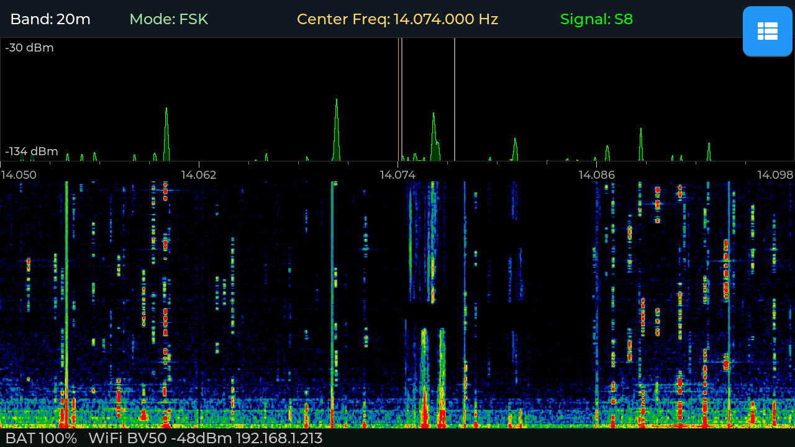
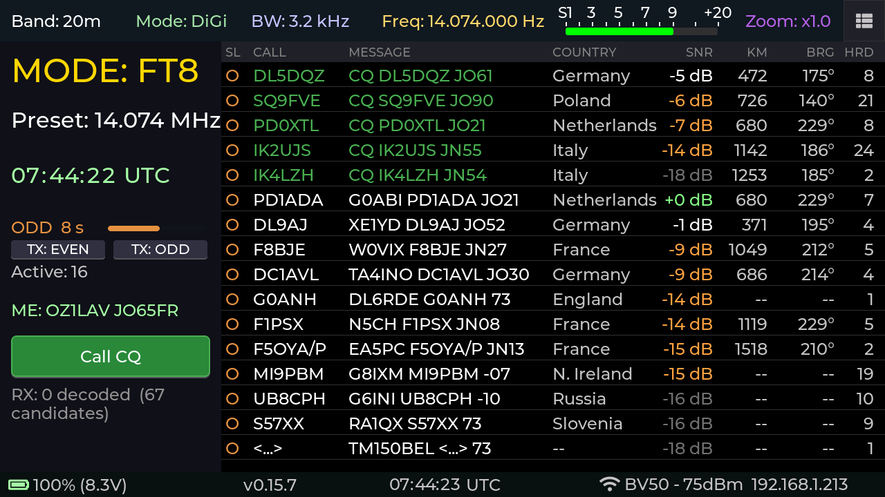

# QMX+ Panadapter

*By Steffen Lav (OZ1LAV).*

A standalone real-time panadapter — spectrum analyser and waterfall — for the [QRP Labs QMX/QMX+](https://www.qrp-labs.com/qmxp.html) HF transceiver, running on the [M5Stack Tab5](https://docs.m5stack.com/en/core/tab5) (ESP32-P4 with a 5" 720×1280 touch display).

The QMX exposes I/Q audio over USB UAC plus CAT control over USB CDC-ACM. The Tab5 connects to the QMX as a USB host, decodes the I/Q in real time on the ESP32-P4, and renders a touch-driven panadapter with tap-to-tune, pinch-zoom, onboard FT8 decoding and transmit, ADIF logging, and a matching browser web UI.



*20 m FT8 pile-up around 14.074 MHz in flat-spectrum mode (v0.9.2). The spectrum trace tracks a per-bin noise floor so real signals pop sharp above a calm baseline. Top bar: band, mode, centre freq, S-meter. Bottom bar: battery, WiFi RSSI, IP. The same view streams live to any browser on the LAN — see [Web UI](#web-ui).*

> **Beta — v0.16.2.** FT8 transmit is functional but not yet soaked across multi-hour sessions. Known gaps: no duty-cycle protection, no audio loopback verification, no over-temperature monitoring. Standard operating practice applies — dummy load for first tests, power/SWR meter if you have one. All other features (panadapter, FT8 RX, web UI, ADIF logging) are stable. The beta label goes away at v1.0.0.

---

## Contents

- [Quick Guide](#quick-guide) — get on air in 10 minutes
- [Panadapter](#panadapter) — spectrum, waterfall, zoom, touch-to-tune, S-meter, memory channels
- [Web UI](#web-ui) — browser panadapter and remote control
- [FT8 Receive](#ft8-receive) — onboard decoder, decode list
- [FT8 Transmit](#ft8-transmit) — reply, CQ-run, auto-QSO, ADIF logging
- [Time sync](#time-sync) — WiFi/SNTP, Tab5 RTC, POTA/offline use
- [Reference](#reference) — gestures, settings drawer, web API, hardware
- [Build from source](#build-from-source)
- [Under the hood](#under-the-hood) — DSP, I/Q correction, quirks
- [Roadmap](#roadmap)
- [Related projects](#related-projects)

---

## Quick Guide

### Step 0 — Check your QMX firmware first

Power the QMX on by itself and read the firmware version off its own display at boot. You need **1.03.002 or newer**. If yours is older, update the QMX *before* connecting the Tab5 — everything that follows depends on it. This takes 10 seconds to verify and saves hours of debugging.

### Step 1 — Flash the Tab5 firmware

Use the one-click flasher in [`tools/QMX-Panadapter flasher/`](tools/QMX-Panadapter%20flasher) (also attached to each [release](https://github.com/SteffenLav/qmx-panadapter/releases)):

1. Plug the Tab5 into your computer with a **USB-C data cable** — charge-only cables will not work.
2. Run the flasher:
   - **Windows** — double-click `flash.bat` (downloads esptool + firmware automatically; nothing to install)
   - **macOS** — double-click `flash.command` (needs esptool once: `brew install esptool` or `pip3 install esptool`)
   - **Linux** — `bash flash.command` (needs `pip3 install esptool`)
3. Wait for `SUCCESS`. The Tab5 restarts on the new firmware.

The flasher downloads the latest release from GitHub automatically. **No internet?** Put a `qmx_panadapter_merged_*.bin` from the [releases page](https://github.com/SteffenLav/qmx-panadapter/releases) next to the flasher and it uses that instead.

Your saved settings (WiFi credentials, callsign, grid, memory channels) survive a re-flash — the flasher does not erase them.

Building from source? See [Build from source](#build-from-source).

### Step 2 — Connect the cables

You need **two** USB connections, and the cable to the QMX is the one people get wrong:

| Connection | Port on Tab5 | Cable | Carries |
|------------|--------------|-------|---------|
| **Tab5 → QMX** | **USB-A** (host) | **USB-A → USB-C, full data cable** | I/Q audio (UAC) + CAT (CDC-ACM) |
| **Tab5 → power** | **USB-C** | Any USB-C power cable (5 V / 2 A+) | Power |

> **The #1 failure is a charge-only cable.** Many USB-C cables — especially thin ones bundled with phones and chargers — carry power only, no data lines. If you use one between the Tab5's USB-A port and the QMX, the Tab5 powers the QMX but sees no audio and no CAT: the spectrum stays flat and the top bar shows `Band: ---`. Use a cable you know does data (one that works for a USB stick or phone file transfer). When in doubt, swap the cable first.

**Power-on order matters.** Turn the **Tab5 on first** and let it finish loading, then turn the **QMX on**. Within a few seconds the top bar should populate Band / Mode / BW and the spectrum should come alive.

Once flashed you can power the Tab5 from any 5 V/2 A USB-C source or the internal battery — the laptop is only needed for flashing. For diagnostics the Tab5 also outputs a serial log over the USB-C data connection (useful if WiFi is not available), but for most users the built-in **Diagnostic log** toggle in the settings drawer is the easier path — see [Step 7](#step-7----something-not-working).

### Step 3 — Find your way around

The whole app is driven by **one-finger swipes from the screen edges** and **taps on the top bar**. The settings drawer is always one swipe away — no hunting for hidden menus.

| Gesture | From | Does |
|---------|------|------|
| Swipe → | Left edge | Toggle Panadapter ↔ FT8 screen |
| Swipe ← | Right edge | Open settings drawer |
| Swipe ↑ | Bottom edge | Open memory channel picker |
| Tap or swipe ↓ | Any top-bar item | Open that item's selector |

Slim "breathing" grip handles on each edge show where to swipe — faint enough not to clutter the display, visible if you look for them.

The top bar reads **Band · Mode · BW · Freq · Signal · Zoom** left to right. Tap any item to open a selector — **Freq** opens the frequency keypad; **Mode** switches USB/LSB/CW/DiGi; **BW** selects SSB filter width (USB/LSB only); **Band** jumps to a configured band; **Zoom** selects a zoom preset.

See the [full gesture table](#gestures) in the Reference section.

### Step 4 — Fill in your settings

**On first boot the Tab5 opens a setup prompt automatically** — it will ask for your callsign, grid square, and WiFi credentials before you reach the main screen. You can skip any field and fill it in later via the settings drawer.

To open the settings drawer at any time: swipe in from the right edge, or tap the right grip handle.

- **WiFi** — enter your SSID and password. Recommended for everyone: you get accurate UTC time (needed for FT8 slot timing), the browser web UI, and remote diagnostics. The **WiFi initiated** checkbox below the WiFi section is an on/off master switch — uncheck it for POTA or field use with no network.
- **Identity** (callsign + grid square) — *only required for FT8 transmit*. Enter your callsign and Maidenhead grid (4 or 6 characters, e.g. `JO45` or `JO45ab`). The grid also drives the distance and bearing columns in the FT8 decode list.

Everything else — dB range, smoothing, colour map, brightness, IQ balance — has sane defaults. Adjust if you want to, but you don't need to on first use.

### Step 5 — Using the panadapter

Switch the QMX to any band and watch it come alive. This is the foundation of the device regardless of which modes you operate.

**Tap or drag to tune.** Touch anywhere on the spectrum or waterfall to place the cyan cursor. Drag and it snaps to a mode-aware grid — 10 Hz steps in CW, 250 Hz in SSB, 500 Hz for FT8 — so you can land precisely on a signal before lifting your finger. Lift, and the QMX retunes.

**Zoom in on a crowded band.** Pinch with two fingers to zoom up to ×24. On a CW band at ×8 or higher you can resolve individual signals a few hundred Hz apart, read the spacing between callers, and pick your target before you tune. The frequency axis scales with you, down to Hz precision at high zoom. Double-tap anywhere to reset to the full 48 kHz view.

**Read your passband.** Two grey vertical lines on the spectrum mark your current filter edges. The BW label in the top bar shows the active width; tap it to choose 2.5 / 2.7 / 2.9 / 3.2 kHz in USB or LSB. A coloured tint fills the passband so you can always see exactly what slice of the band you're receiving.

**Watch the S-meter.** The Signal field in the top bar is a live tick-scale bar (S1 through S9+20), driven by the actual signal under your VFO cursor.

**Flat-spectrum mode.** Toggle **Flat spectrum** in the settings drawer to switch from absolute dBm to dB-above-local-noise-floor. Noise collapses to a calm baseline; real signals — including weak CW tones in the mud — pop sharply above it. Recommended on noisy bands.

**Save your spots.** Swipe up from the bottom edge to open the memory channel picker. Long-press an empty slot to save the current frequency and mode with a label. Tap to recall — the QMX retunes instantly.

**Monitor from another room — or operate remotely.** Once WiFi is configured, open `http://<tab5-ip>` in any browser for a full-featured live panadapter with mouse-driven tuning, band/mode controls, and ADIF log download. The IP is shown in the bottom status bar. See [Web UI](#web-ui).

### Step 6 — FT8 (if that's your thing)

Swipe in from the **left edge** to switch to the FT8 screen. The Tab5 starts decoding 15-second slots immediately — no PC, no WSJT-X required.

1. Tap the **Preset** button and pick your band's conventional FT8 dial frequency (e.g. 14.074 MHz for 20 m).
2. Watch the decode list fill. CQ stations appear at the top sorted by SNR; exchanges and replies below.
3. To reply to a station: **hold your finger on their row** for ~250 ms. A dim highlight appears after ~80 ms so you can see which row you're targeting before the gate fires. Lift — a confirmation modal shows the exact message before anything is armed.
4. Tap **Auto Pounce** to hand the full QSO to the auto-engine (works through report → RR73 → 73 with patient retry), or **Transmit** for a single manual message.
5. To call CQ: tap **Call CQ**. The engine picks a clear audio slot, fires CQ, automatically answers the first caller, runs the full exchange, logs the QSO, and resumes calling CQ.

Every completed QSO is written to an ADIF log downloadable from the web UI. See [FT8 Transmit](#ft8-transmit) for the full picture.

### Step 7 — Something not working?

**Spectrum flat, top bar shows `---`:**
- Check the cable between Tab5 and QMX — almost always a charge-only cable.
- Make sure the QMX is powered on and not stuck in its own bootloader.
- Power cycle in order: Tab5 first, then QMX.

**For anything else:**

1. Open the settings drawer → flip **Diagnostic log** ON (top row).
2. Reproduce the problem (let it run a minute; power-cycle the QMX if the issue is about connection).
3. Grab the log:
   - **Over WiFi:** browse to `http://<tab5-ip>/api/log` or click **Diag log ↓** in the web UI bottom bar — downloads `qmx-log.txt`.
   - **Over USB (no WiFi needed):** capture the serial console with `tools/capture_serial_log.ps1`.
4. Open an [issue](https://github.com/SteffenLav/qmx-panadapter/issues) and attach the log. It includes Tab5 and QMX firmware versions plus every CAT command exchanged — usually enough to pinpoint the problem immediately.

---

## Panadapter

### Spectrum and waterfall

The display is divided into a **200 px spectrum** (green curve with dim fill), an **18 px frequency axis**, a **412 px waterfall**, and a 30 px bottom bar. The full visible span is 48 kHz centred on the QMX VFO.

The **spectrum** shows signal power in dBm (default range −130 to −30 dBm). Each frame is smoothed per-bin with an exponential moving average (EMA α = 0.4 by default, adjustable in the drawer), balancing visual stability against snappy response to CW signals and SSB attack transients.

The **frequency axis** shows absolute MHz labels centred on the QMX VFO, refreshed on every CAT frequency update. At high zoom levels the labels resolve to kHz or Hz precision.

The **waterfall** runs newest row at the top in a thermal SDR palette (black → dark blue → teal → green → yellow → red). Four colour maps are available in the settings drawer: Thermal, Viridis, Turbo, and Grayscale.

**Waterfall floor tracking.** The waterfall's black level tracks the band noise automatically — a running median sampled only from bins inside the passband, EMA-smoothed — so the background colour follows conditions rather than a fixed anchor. Bins outside the passband run darker and are excluded from the floor calculation so they don't wash out dim in-band signals.

**Flat-spectrum mode** (toggle in the settings drawer, persisted to NVS) switches both spectrum and waterfall to a per-bin adaptive display: each bin renders as dB above its own running noise floor. Real signals — including weak CW tones — stand out sharply against a calm baseline. This is the recommended mode on noisy bands. The dB range sliders have no effect in flat mode; the axis shows relative dB above floor.

### Touch-to-tune

Tap anywhere on the spectrum or waterfall to place the cyan tune cursor. Drag and the cursor snaps grid-point to grid-point — you can see exactly which frequency will be tuned before you lift. The snap grid is **mode-aware**:

| Mode | Snap step |
|------|-----------|
| CW / CW-R | 10 Hz |
| USB / LSB | 250 Hz |
| FT8 / DiGi / RTTY | 500 Hz |
| AM / FM | 1 kHz |

The grid is anchored to absolute frequency (e.g. …200 / 300 / 400 Hz), not to your touch start point, so the cursor always lands on the same set of grid points regardless of where your finger first touches.

A floating frequency tooltip above the cursor shows the target frequency in real time while dragging. Lift → CAT `FA` command is sent; QMX retunes; spectrum re-centres.

**Snap-to-strongest-bin.** At zoom ×1 a tap searches ±700 Hz around the touched position for the strongest spectrum bin and snaps to it — only when the peak exceeds the local mean by >3 dB, so touches on empty noise floor still tune to the raw position.

**Passband indicator.** Two grey vertical lines mark your current filter edges. A faint coloured tint fills the passband. The amber VFO marker shows where the QMX is tuned; in CW mode it sits at dial + CW pitch offset so it marks the actual received tone frequency, not the suppressed carrier.

### Zoom and pan

| Gesture | Effect |
|---------|--------|
| Pinch (two fingers) | Zoom ×1.0 – ×24.0 |
| Two-finger drag | Pan the zoomed window |
| Double-tap | Reset zoom and pan to ×1.0 / centred |
| Top-bar Zoom → tap | Zoom preset: ×1 / ×2 / ×4 / ×8 / ×16 / ×24 |

At zoom > ×1 the view **centres on the passband** (not the VFO dial), which matters for USB/LSB where the passband sits offset from the carrier. The passband lines and frequency axis track correctly at all zoom levels. Zoom level is persisted to NVS and restores with full zoom-FFT resolution on the next boot.

### S-meter

The Signal field in the top bar is a visual tick-scale bar labelled S1, S3, S5, S7, S9, +10, +20 with a moving green bar beneath. It is driven by the peak dBm in a ±64-bin window centred on the IF-shifted VFO bin — the actual signal under your cursor, not the DC/LO artefact at bin 0.

S-unit mapping: S9 = −73 dBm; 6 dB per S-unit below S9; 1 dB per unit above S9. The meter stays live during FT8 capture.

### Memory channels

Swipe up from the bottom edge (or tap the bottom grip handle) to open the 4×8 memory channel grid (32 slots, NVS-persisted).

| Action | How |
|--------|-----|
| Recall | Tap a slot — QMX retunes to stored frequency and mode |
| Save | Long-press an empty slot — frequency/mode picker opens, then a label keyboard |
| Edit / delete | Long-press an occupied slot |

Memory slots show the label in large text and mode + frequency (dimmed) below. The frequency/mode picker pre-fills the current VFO and lets you edit both before naming.

### Settings drawer

Open by swiping in from the right edge, or tapping the right grip handle. The drawer is scrollable.

| Control | What it does |
|---------|--------------|
| **Diagnostic log** | Captures all firmware log output to a 512 KB ring (top row — stays visible in FT8 mode) |
| **Display brightness** | 10–100%, persisted |
| **Flat spectrum** | Toggle flat/absolute display mode, persisted |
| **IQ Balance** | Toggle adaptive I/Q image correction; re-enabling resets the estimator |
| **Presets** | HF Normal / HF DX / Strong Sig — sets dB range and smoothing in one tap |
| **dB Range** | Min and Max sliders (dBm) |
| **Smoothing** | EMA alpha 0.05–1.00 |
| **Waterfall colour map** | Thermal / Viridis / Turbo / Grayscale, persisted |
| **IF calibration** | ±200 Hz trim for per-unit LO variance (see [Per-unit IF calibration](#per-unit-if-calibration)) |
| **CW pitch** | 400–1000 Hz sidetone offset; touch-to-tune in CW mode snaps to this offset, persisted |
| **WiFi** | Opens credential modal; **WiFi initiated** checkbox enables/disables WiFi entirely |
| **Identity** | Callsign + Maidenhead grid (required for FT8 TX; also drives KM/BRG columns) |

---

## Web UI

With the Tab5 on WiFi, open `http://<tab5-ip>` in any modern browser. The IP is shown in the bottom status bar on the Tab5.

The browser panadapter is a full-featured view in its own right — not just a window onto the Tab5. On a larger monitor you get more spectrum history, a bigger waterfall canvas, and mouse controls that are faster than touch for precise tuning. It shows live spectrum at ≈10 fps via WebSocket, full waterfall history (~50 s), the same thermal palette and floor maths, a graphical S-meter, and a top bar with Band / Mode / BW / Zoom controls. The bottom bar shows battery percentage + voltage, firmware version, a live UTC clock, WiFi SSID + RSSI, and IP address.

**Click or drag to tune.** Click or drag on the spectrum or waterfall — a cyan cursor appears with a live frequency readout and commits on release.

**Mouse-wheel to pan or tune.** Rolling the mouse wheel over the spectrum or waterfall **pans** the view when zoomed in, letting you survey the band without touching the Tab5. At zoom ×1 the wheel **tunes** with mode-aware snap (CW 10 Hz, SSB 500 Hz, DiGi 100 Hz, AM/FM 1 kHz).

**Band / Mode / BW / Zoom** dropdown pills in the top bar send commands to the QMX via `/api/cmd` — the same effect as using the Tab5 top bar.

**Zoom sync.** The browser renders the same zoomed window as the Tab5.

**ADIF log download.** Once you have logged at least one completed FT8 QSO, a **"N QSOs ↓"** link appears in the bottom-right corner of the web UI. Clicking it downloads your `qso.adi` file directly. The link is only shown when the log contains data — it disappears after clearing the log with `/api/adif/clear`.

### Endpoints

| Endpoint | Method | Returns |
|----------|--------|---------|
| `/` | GET | Browser panadapter (HTML) |
| `/api/status` | GET | JSON status (see below) |
| `/api/cmd` | POST | Send Band/Mode/BW/Zoom commands |
| `/api/log` | GET | Diagnostic log download (`qmx-log.txt`) |
| `/api/adif` | GET | ADIF QSO log download (`qso.adi`) |
| `/api/adif/clear` | GET | Wipe ADIF log and worked-call cache |
| `/ss.bmp` | GET | 1280×720 RGB565 BMP screenshot |
| `/ws` | WS | Binary spectrum stream (~10 fps) |

### `/api/status`

```json
{
  "battery":     { "level": 100, "mv": 8320, "charging": true },
  "wifi":        { "ssid": "MyNet", "rssi": -44, "ip": "192.168.1.213" },
  "freq_hz":     14074000,
  "mode":        "USB",
  "band":        "20m",
  "passband_hz": 2700,
  "signal_dbm":  -87.4,
  "zoom":        1.0,
  "pan_bins":    0,
  "flat_mode":   false,
  "utc_epoch":   1750000000,
  "tab5_fw":     "v0.16.2",
  "qmx_fw":      "1_03_002QMX"
}
```

Polled at 1 Hz by the landing page; safe to consume from monitoring scripts, home automation, etc. `qmx_fw` is read from the QMX via the `VN;` CAT command at link-up (empty until the radio responds). `signal_dbm` is the peak dBm around the IF-shifted VFO bin (null if DSP has no data yet).

### `/ws` — binary spectrum WebSocket

Single-client endpoint. Each binary frame is 1026 bytes:

| Bytes | Meaning |
|-------|---------|
| `0` | Frame type: `0x01` = spectrum |
| `1` | Zoom decimation factor (1 = base 1024-bin spectrum, >1 = zoom-FFT with that decimation) |
| `2–1025` | 1024 unsigned bytes, one per bin, quantised −130 dBm (0) to −30 dBm (255) |

Bins are pre-shifted server-side so byte 2 is the leftmost screen pixel. Push rate ≈10 fps.

### Screenshots

```powershell
Invoke-WebRequest -Uri "http://192.168.1.213/ss.bmp" -OutFile screenshot.bmp
```

---

## FT8 Receive



*Live FT8 reception on 20 m (v0.15.7). Left pane: MODE / Preset freq / UTC / slot countdown with parity and progress bar / TX parity preference / operator identity / Call CQ / decode summary. Right pane: scrollable decode list.*

Swipe in from the **left edge** to switch to the FT8 screen. The Tab5 decodes 15-second FT8 slots directly on the ESP32-P4 — no PC, no WSJT-X.

### Prerequisites

- **WiFi configured** — recommended for accurate UTC time. Without it the Tab5 falls back to its supercap RTC or the QMX clock. See [Time sync](#time-sync).
- **Callsign and grid** set in the drawer → **Identity** if you want distance/bearing columns or plan to transmit.

### The FT8 screen

**Left pane:** MODE label · **Preset** frequency button (tap to pick a band's conventional FT8 dial frequency) · UTC clock · 15-second slot countdown with current parity (EVEN blue / ODD amber) and a gliding progress bar · TX: EVEN / TX: ODD parity preference buttons · Active station count · **Call CQ** button · last-slot decode summary.

**Right pane — decode list:**

| Column | Content |
|--------|---------|
| SL | Slot parity: **E** (blue, :00/:30) or **O** (amber, :15/:45) |
| CALL | Extracted callsign |
| MESSAGE | Full decoded FT8 message text |
| COUNTRY | DXCC entity from prefix lookup (~190 entities) |
| SNR | FFT-based estimate, colour-banded: green ≥0 / white −5..−1 / orange −15..−6 / grey <−15 |
| KM | Great-circle distance from your grid |
| BRG | Bearing from your grid |
| HRD | Times decoded since last appearance |

CQ calls always appear at the top sorted strongest-SNR first; all other rows follow by SNR descending.

**Live view.** Stations not re-decoded within 60 seconds drop off the list automatically, even while the band is quiet. The count reads "Active: N" — who's on frequency *now*, not a cumulative history.

### Performance

On a busy 20 m FT8 slot the decoder regularly yields 25–50 callsigns per slot. Both EVEN and ODD slots decode every cycle via a ping-pong dual-buffer architecture — a TX slot never causes the opposite parity to be skipped. Heap is stable across long sessions (≈39 KB internal RAM free, 25 MB PSRAM free during decoding).

---

## FT8 Transmit

> **Known limitations (beta):** no duty-cycle protection (the firmware will not refuse consecutive TX slots), no audio loopback verification, multi-hour TX soak testing not yet completed. Use a dummy load for first tests; a power/SWR meter is useful but not required — the Tab5 reads `PC;`/`SW;` from the QMX after each burst and shows the result. The QMX has a built-in CAT timeout (120 s default) that returns it to RX if the Tab5 stops sending commands.

The Tab5 transmits FT8 via the QMX's `TA<freq>;` CAT command — no PC audio path, no WSJT-X. The QMX does all DDS synthesis and envelope shaping; the Tab5 sends the 79 tone-frequency commands at 160 ms cadence, bracketed by `TX;` / `TA0;` / `RX;`.

### Replying to a station

1. In the decode list, **hold your finger on a row** for ~250 ms. A dim highlight appears after ~80 ms so you can see which row you're targeting. List scroll locks once the gate fires; drag up or down to land on the right row.
3. **Lift** — a confirmation modal shows the exact message that will go on air, the audio frequency, and the target slot parity.
4. Tap **Auto Pounce** to hand the full QSO to the auto-engine, or **Transmit** for a single manual message.
5. Tap **Cancel** (in the modal, or the armed indicator in the left pane) to disarm without transmitting.

The reply is the standard FT8 exchange: `<their_call> <my_call> <my_grid>`. Slot parity is set automatically — if you heard them on an EVEN slot, your reply goes on ODD so they're listening when you transmit.

**The auto-engine** works the full exchange: TX1 (grid) → wait for their report → TX2 (R+report) → wait for RR73/73 → TX3 (73) → DONE. At every step it re-sends the current message for up to 4 consecutive slots if the other station doesn't respond. If no reply comes after 4 slots, the QSO times out (orange status, tap to clear).

### Calling CQ — CQ-run mode

Tap **Call CQ**. No confirmation modal. The engine:
1. Scans the current decode list for occupied 50 Hz audio bins.
2. Picks the nearest unoccupied bin to 1500 Hz (standard FT8 sub-band centre).
3. Arms the CQ on the matching slot parity and waits for the boundary.

From there it's fully automatic:
- The opposite-parity slot is decoded while CQ runs so replies are never missed.
- The moment a station replies with your callsign, CQing stops and the exchange starts automatically — best-SNR caller chosen if multiple stations answer simultaneously.
- After the exchange completes (RR73 → 73 → logged), CQ resumes on the same frequency.
- A mid-exchange timeout also resumes CQ rather than dropping the frequency.
- While CQ-run is active, other stations' `CQ` rows are hidden so replies to you stand out.

Tap **Cancel** in the TX status bar at any time to stop.

### Reply filter

Tap **Filter** in the left pane to open the filter editor. Controls which stations CQ-run auto-answers and which rows appear in the decode list.

- **Include 1 / Include 2** — if either field has text, only messages containing one of its terms are eligible. Space- or comma-separated (e.g. `POTA SOTA` or `JA, VK`), matched against the *whole* decoded message text so POTA/SOTA tags, grid squares, country prefixes, `/P` suffixes etc. all work.
- **Exclude 1 / Exclude 2** — messages containing any of these terms are skipped even if they'd otherwise match.
- **Exclude plain CQ callers** — hides bare `CQ ...` rows so only replies and exchanges remain visible.
- **Exclude worked-before** — hides callsigns already in your ADIF log from the list and from CQ-run auto-replies.

Tap **Save** to persist (NVS) and apply immediately.

### TX status indicator

The left pane shows a persistent status line below the slot countdown:

| Colour | Meaning |
|--------|---------|
| **Red** | `TRANSMITTING: <message>` — burst in progress; tap to abort |
| **Amber** | `TX armed: <message> → EVEN/ODD, ~Ns` — waiting for slot; tap to cancel |
| **Red-orange ⚠ FREQ BUSY** | Armed tone is occupied (±50 Hz guard) — retune to a clear slot |
| **Green** | QSO complete |
| **Orange** | QSO timed out — tap to clear |
| **Dim white** | FT8 engine status passthrough (capturing / decoding / symbol count / …) |

### QSO override buttons

During an active auto-QSO exchange (any state between first reply and final 73), three buttons appear in the left pane:

| Button | What it does |
|--------|--------------|
| **Re-send / &lt;field&gt;** (amber) | Re-arms the current outgoing message immediately. The label shows what will go out — e.g. **Re-send / JO45** when waiting for their report, **Re-send / -07** when waiting for RR73 |
| **RR73** (blue) | Skips straight to RR73, bypassing the report step |
| **73** (green) | Fires the 73 sign-off and closes the QSO immediately |

These are deliberate operator nudges for busy-band edge cases where the auto-engine falls a slot behind or you can see the exchange is further along than the state machine knows. The auto-engine handles the normal case; these exist for when a quick nudge is faster than waiting through the 4-slot retry cycle.

### TX power / SWR readout

After each burst the Tab5 queries `PC;`/`SW;` for instantaneous forward power and SWR and shows the result briefly in the status line: `Last TX: X.XW SWRx.xx [Ns]`. If SWR > 4.0 (indicating the QMX SWR-protection latch tripped), the firmware automatically cycles `TX;` / 150 ms / `RX;` to clear the latch so the radio is ready for the next TX slot without operator intervention.

### CQ message presets

Long-press the **Call CQ** button to open the preset editor. Three message slots with radio buttons — check the active one. A `+ <call> <grid>` quick-insert appends your identity. Standard CQ constructions (`CQ DX OZ1LAV JO65FR`, `CQ POTA …`) and ≤13-char free text both encode via the general ft8_lib encoder. Presets persist to NVS. The Call CQ button label shows the selected message; a short tap transmits it.

### QSO logging (ADIF)

Every completed FT8 QSO — pounce or CQ-run — is automatically written to an ADIF v3.1.4 file at `/spiffs/qso.adi` on the Tab5's internal flash. The log survives reboots and re-flashes.

**Download.** The web UI bottom bar shows **"N QSOs ↓"** once the first QSO is logged. Clicking it downloads `qso.adi` for import into any logging software (WSJT-X, Log4OM, DXKeeper, …) or upload to LoTW, QRZ, eQSL, POTA.app.

**Fields in each record:**

| ADIF field | Content |
|------------|---------|
| CALL | Their callsign |
| FREQ | Dial frequency in MHz (3 d.p., e.g. `14.074`) |
| BAND | Amateur band (e.g. `20M`) |
| MODE | `FT8` |
| SUBMODE | `FT8` (required by LoTW TQSL and eQSL for digital mode credit) |
| RST_SENT | Our SNR estimate (e.g. `−07`; `599` if unavailable) |
| RST_RCVD | Signal report received |
| QSO_DATE | UTC date `YYYYMMDD` |
| TIME_ON | UTC time `HHMMSS` |
| MY_CALL | Your callsign (from Identity in the drawer) |
| MY_GRIDSQUARE | Your grid |
| GRIDSQUARE | Their grid (from the decoded FT8 message) |

**Clear.** `GET /api/adif/clear` from the web UI wipes the file and resets the worked-call cache.

> Set your callsign and grid in the settings drawer → **Identity** before your first QSO so they appear correctly in logged records.

---

## Time sync

The Tab5 needs accurate UTC for FT8 slot timing. Sources in priority order (highest first):

| Source | When applied |
|--------|-------------|
| **SNTP (WiFi)** | Always authoritative when WiFi is up — sets system clock, Tab5 RTC, and NVS |
| **Tab5 RTC** | RX8130CE supercap-backed (~30–40 h retention) — applied at boot before QMX or WiFi are available |
| **QMX `TM;`** | Applied only when SNTP has not synced within the last 10 minutes (field/POTA with no WiFi) |
| **FT8 signal timing** | Sub-second correction from decoded signal phase — applied via the **Sync Time** modal (see below) |
| **Manual** | Full HH:MM override in the **Sync Time** modal — for rare POTA sessions with neither WiFi nor QMX clock |

Each accepted sync writes through to the RX8130CE so the clock persists across power-off. The Tab5 also polls `TM;` every 5 minutes in the background to catch QMX GPS lock events.

**For POTA / no-WiFi use:** uncheck **WiFi initiated** in the settings drawer. Time comes from the QMX on USB connect (or the supercap RTC if the Tab5 was recently synced). FT8 slot timing will be accurate from either source.

### FT8 time calibration modal

On the FT8 screen, tap **Filter** → **Sync Time** to open the time calibration modal. It shows three large boxes: **\[HH\] : \[MM\] : \[SS\]**.

- **HH / MM** — pre-filled from the current UTC clock. Tap either box to edit it with a numpad. Use this for rare POTA situations where neither WiFi nor the QMX clock is available.
- **SS** — auto-syncs continuously from decoded FT8 signals. Each time a slot decodes, the decoder measures the exact sub-second offset between the incoming signal and where it should fall on the UTC boundary; the SS box updates to show the corrected seconds value and the offset (e.g. **FT8 +120 ms** or **FT8 ok** when under a threshold). A blue frame means it is actively tracking; tap SS to lock it.
- **Apply** — if only SS was synced (HH and MM untouched), `time_sync_apply_correction_ms()` nudges the system clock by the measured sub-second offset and writes through to the RTC. If HH or MM was edited, `time_sync_set_manual()` sets the full time. The bottom bar shows **UTC(FT8)** after an FT8-derived correction, or **UTC(manual)** after a full manual set.

---

## Reference

### Gestures

| Gesture | Where | Effect |
|---------|-------|--------|
| Tap | Spectrum / waterfall | Tune to tapped frequency (snapped) |
| Touch + drag | Spectrum / waterfall | Cyan cursor snaps grid-to-grid; tunes on release |
| Double-tap | Spectrum / waterfall | Reset zoom and pan to ×1.0 / centred |
| Pinch (two fingers) | Spectrum / waterfall | Zoom ×1.0–×24.0 |
| Two-finger drag | Spectrum / waterfall (zoomed) | Pan the zoomed window |
| Swipe → from left edge | Left edge strip | Toggle Panadapter ↔ FT8 screen |
| Swipe ← from right edge | Right edge strip | Open settings drawer |
| Tap right grip handle | Right edge | Open settings drawer (alternative) |
| Swipe → | Open drawer, or spectrum while drawer open | Close settings drawer |
| Swipe ↑ from bottom edge | Bottom edge strip | Open memory channel picker |
| Tap or swipe ↓ | Top-bar item (Band/Mode/BW/Freq/Zoom) | Open that item's selector |
| Touch and hold ~250 ms | FT8 decode list row | Dim preview at ~80 ms; full selection at 250 ms (scroll locks, drag moves highlight, lift to confirm) |
| Quick swipe | FT8 decode list | Scroll the list normally |

### Per-unit IF calibration

The QMX's +12 kHz IF injection varies slightly between units. If signals appear consistently shifted left or right of where the QMX is actually tuned, open the settings drawer → **IF calibration** slider (±200 Hz, 10 Hz steps, persisted to NVS). Default 0. Reported by Ken KF0AYY, whose unit needed about −55 Hz to centre correctly.

### Hardware

- **M5Stack Tab5** — ESP32-P4 v1.3 (ECO2), ST7121 or ST7123 5" 720×1280 MIPI-DSI touch display, 32 MB PSRAM, ESP32-C6 co-processor for WiFi
- **QRP Labs QMX or QMX+** — firmware 1.03.002 or newer required
- **USB-A → USB-C data cable** between Tab5 USB-A host port and QMX (full data, not charge-only)
- **USB-C power supply** for the Tab5 (5 V / 2 A or better, or internal battery)

```
┌──────────────┐   USB-A → USB-C (data cable)   ┌─────────────┐
│  M5Stack     │ ──────────────────────────────► │   QMX+      │
│  Tab5        │   UAC: I/Q audio (48 kHz stereo)│             │
│              │   CDC-ACM: CAT control          └─────────────┘
│              │
│              │   USB-C (any power cable)       ┌─────────────┐
│              │ ──────────────────────────────► │  5 V source │
└──────────────┘                                 └─────────────┘
```

### What works without the QMX connected

| Works without QMX | Needs QMX connected |
|-------------------|---------------------|
| UI, settings drawer, gestures | Spectrum + waterfall (no I/Q = flat line) |
| WiFi, web UI, screenshots | Top bar Band / Mode / BW |
| Callsign / grid / WiFi credentials | Tap-to-tune, mode popup (CAT writes) |
| Brightness, colour map, dB range | S-meter, FT8 decode/TX, QMX firmware readout |

If the spectrum is flat and the top bar shows `---`, that is almost always the radio not being seen over USB — which loops back to the cable (or the QMX being off / in flash mode).

### Reporting hardware issues

Near the top of the boot log you will see:

```
I (xxxx) bsp_info: === TAB5 BSP INFO ===
I (xxxx) bsp_info: chip:     ESP32-P4 rev v1.3
I (xxxx) bsp_info: psram:    30 MB
I (xxxx) bsp_info: panel:    ST7123 (inferred from touch)
I (xxxx) bsp_info: touch:    ST7123 @ 0x55
I (xxxx) bsp_info: heap:     230.5 kB internal free, 28.80 MB PSRAM free
I (xxxx) bsp_info: idf:      v5.4.4
I (xxxx) bsp_info: firmware: v0.16.2
I (xxxx) bsp_info: =====================
```

When opening a hardware issue, paste this block — the `panel` and `touch` lines are the first thing needed to identify which Tab5 hardware revision you have.

> **Note on `reset_reason`:** a deliberate reset-button force-off returns `panic/exception`, not `external-pin`/`power-on`. A genuine firmware crash always prints a `Guru Meditation` register + backtrace dump immediately *before* the reboot. No backtrace = abrupt power-off, not a crash.

---

## Build from source

Requires **ESP-IDF v5.4.4** — pinned; do not upgrade. ESP32-P4 v1.3 silicon requires `CONFIG_ESP32P4_REV_MIN_0=y` and CPU capped at 360 MHz, both baked into `sdkconfig`.

```powershell
# Activate the IDF environment, then:
idf.py build flash monitor
```

Or with the `qmx` PowerShell helper — add to your `$PROFILE` and adjust the COM port:

```powershell
function qmx {
    param([string]$cmd = "fm")
    if (-not $env:IDF_PATH) { & C:\esp\v5.4.4\esp-idf\export.ps1 }
    switch ($cmd) {
        "b"   { idf.py build }
        "f"   { idf.py flash }
        "m"   { python -m esp_idf_monitor -p COM3 build\qmx_panadapter.elf }
        "fm"  { idf.py flash; python -m esp_idf_monitor -p COM3 build\qmx_panadapter.elf }
        "bfm" { idf.py build flash; python -m esp_idf_monitor -p COM3 build\qmx_panadapter.elf }
    }
}
```

Exit monitor: `Ctrl+T` then `Ctrl+X`.

---

## Under the hood

### I/Q balance correction

The QMX presents I/Q audio with a small but measurable amplitude imbalance and quadrature error between channels. Without correction, every signal produces a mirror image across the centre frequency (~30 dB weaker), cluttering the waterfall on a busy band.

A blind adaptive Gram-Schmidt orthogonaliser runs sample-by-sample in the audio pipeline before the FFT. It maintains running estimates of:
- **DC offset** on each channel (τ = 1 s)
- **Power** in I and Q (τ = 200 ms)
- **Cross-product** I·Q (τ = 1 s) — non-zero cross-product means the channels are not orthogonal

Correction per sample:

```
i_out = i
q_out = (q − K_phi · i) × K_amp
```

No calibration step needed; the estimator converges on ambient band noise within a few seconds of any signal. A two-speed startup runs all alphas at 8× for the first 2 s of real signal after each reset (effective convergence ~125 ms), then drops to steady-state. Toggle in the settings drawer; re-enabling resets the estimator so it reconverges from a clean state.

### DSP pipeline

- **FFT:** 1024-pt complex, Blackman-Harris window. esp-dsp ANSI fallback is used (the PIE/vector version crashes under sustained WebSocket load on this silicon).
- **IF offset:** The QMX presents I/Q at +12 kHz; spectrum, waterfall, and S-meter all shift bin selection by `n_bins/4` so the VFO signal appears at the visual centre.
- **DC blocker:** one-pole IIR on the I/Q stream before FFT.
- **Spectrum smoothing:** per-bin EMA (α = 0.4 default, adjustable).
- **dBm calibration:** `DSP_DB_CALIBRATION_OFFSET = −148.0 dB` measured on dummy load; noise floor reads −130 dBm; S9 = −73 dBm.
- **Waterfall scroll:** 1280×824 double-height canvas (~130 µs/tick vs ~92 ms with memmove).
- **Audio task:** polling on core 0 with a drain loop. Event-driven reads caused noise-floor pumping (~13 s cycle) from truncated UAC chunks; this architecture eliminates it.

### Quirks and trade-offs

**PI4IO expander must be initialised before display bring-up.** The Tab5's PI4IO I/O expander holds `LCD_RST` and `TP_RST` low at chip power-on. Without explicit init, on a true cold boot the panel never comes out of reset and the DSI FIFO hangs. Soft resets mask this because the expander retains state across ESP32 resets. `display_init` calls `bsp_i2c_init()` + `bsp_io_expander_pi4ioe_init()` first, then waits 120 ms.

**Patched components in `components/`.** `espressif__usb_host_uac/` has `create_background_task = true` — required for UAC and CDC-ACM to coexist on the same USB host. `espressif__esp_lcd_touch_st7123/` makes `FW_VERSION_REG` the only mandatory register read (ST7121 NACKs the others and also adds a `max_touches > 10` bounds clamp). Do not replace either with the registry version without re-applying the patches.

**LVGL software rotation (~50% FPS cost).** The panel is natively portrait; landscape is achieved via `lv_display_set_rotation(LV_DISPLAY_ROTATION_90)`. Every flush goes through `rotate90_rgb565`. ~13 fps landscape vs ~22 fps portrait — acceptable for a panadapter. PPA hardware rotation conflicts with the USB host stack over DW-GDMA channels and silently kills UAC + CDC-ACM; do not set `CONFIG_LVGL_PORT_ENABLE_PPA=y`. Full native-portrait rendering (Phase 6.3) is on the longer-term roadmap.

**IDLE watchdog disabled.** The LVGL rotation pipeline keeps CPU0 busy past the default watchdog window. `CONFIG_ESP_TASK_WDT_CHECK_IDLE_TASK_CPU0/CPU1` are off; the app-task watchdog (30 s) is still active.

**Cross-thread CAT writes must go through the poll task.** Writing CAT commands directly from the LVGL thread races the FA/MD/FW poll on the same CDC pipe — commands interleave and the QMX returns `?;`. Pattern: stash the request in a `volatile` and let `poll_task` drain it on its next cycle. See `s_pending_ssb_bw` / `cat_request_ssb_bandwidth()` in `cat.c`.

**SSB filter bandwidth needs three coordinated writes.** `MMSSB|Filter RX=<hz>;` commits the value (persists, shows in QMX menu); `MMSSB|Bandwidth=<hz>;` applies it live; `FW;` polling must be suspended while the width is pinned because reading the filter makes the QMX revert it. Dead ends: `FW<nnnn>;` CAT set returns `?;`; re-asserting the same mode digit does not reload the filter; `Bandwidth` write alone reverts on the next poll.

### Project layout

```
main/
  main.c                    app_main, task launch, orchestration
  display/display.c         BSP bring-up (PI4IO + LCD + touch)
  ui/ui.c                   LVGL widgets, touch handler, canvases
  ui/ft8_screen_view.c      FT8 decode list, touch-drag row selection
  ui/ft8_tx_modal.c         TX confirmation modal
  cat/cat.c                 USB CDC-ACM + Kenwood CAT
  audio/audio.c             USB UAC + ring buffer producer
  dsp/dsp.c                 FFT, spectrum mutex, DC blocker
  dsp/iq_balance.c          Gram-Schmidt I/Q correction
  ft8_tx.c                  FT8 TX engine (build/arm/run/abort)
  ft8_test.c                FT8 slot loop (RX decode / TX burst)
  ft8_qso.c                 Auto QSO state machine
  ft8_status.c              Mutex-protected FT8 status string
  adif/adif_log.c           ADIF QSO logging
  rtc/rtc.c                 RX8130CE supercap RTC driver
  time_sync/time_sync.c     Time sync orchestrator
  render/render.c           30 Hz render task, EMA smoothing
  render/render_waterfall.c Waterfall scroll (double-height canvas)
  screenshot/screenshot.c   RGB565 framebuffer capture for /ss.bmp
  storage/settings.c        NVS-backed settings with debounced flush
  wifi/wifi.c               C6 co-processor WiFi + SNTP
  net/webserver.c           HTTP server + WebSocket
  util/fps.c                FPS counter
  util/diag_log.c           Diagnostic log ring buffer (vprintf hook)
```

---

## Roadmap

### Next up

The path to v1.0 is a complete standalone FT8 station with TX, logging, and ADIF upload.

- **v0.16.x — "Worked before" highlighting.** Colour-code FT8 decode list rows by whether the callsign is already in the ADIF log — high value for POTA/SOTA activators chasing new contacts. `adif_log_contains_call()` is implemented and ready; needs wiring into `rebuild_list()`.
- **v0.16.x — ADIF upload.** HTTP POST to LoTW TQSL, QRZ, eQSL, or POTA.app from the web UI.
- **v0.16.x — Manual time-set UI.** Settings drawer entry point for `time_sync_set_manual()` — for rare POTA sessions with neither WiFi nor QMX clock.
- **v1.0.0 — Stable release.** Multi-day FT8 soak complete, polished UI, beta label gone.

### Longer term

- **CW decoder.** Goertzel-based, text scrolling under the spectrum. The QMX already does this internally — question is whether to mirror its output via CAT or run a parallel decoder on the Tab5.
- **Tab5 speaker / headphone audio.** Demodulated CW/SSB passband audio out of the Tab5's own jack, so the operator can monitor without the QMX's audio path.
- **Extended waterfall history.** PSRAM has room for several minutes of scrollback; two-finger drag to scrub through history.
- **Phase 6.3 — Native-portrait rendering.** ~50% FPS recovery by rendering directly in the panel's native 720×1280 portrait coordinates, eliminating the LVGL rotation step. Significant UI rewrite; deferred.
- **QMX (small) support.** Same UI, different USB endpoint config and band table.
- **JS8 / RTTY modes.** See `docs/js8-feasibility.md` and `docs/rtty-feasibility.md`.
- **DSP polish.** Noise reduction, auto-notch.
- **Flat-mode tunables in the drawer.** The per-bin floor parameters are compile-time constants; sliders + NVS persistence would let operators tune the display without rebuilding.

---

## Related projects

- [DX-FT8](https://github.com/WB2CBA/DX-FT8-FT8-MULTIBAND-TABLET-TRANSCEIVER) by Barb (WB2CBA) — open-hardware FT8 tablet transceiver; an inspiring reference for a similar use-case
- [`qrp_companion`](https://groups.io/g/QRPLabs/topic/118645485) by Zhenxing Han (N6HAN) — Tab5 companion for QMX with audio + CAT; source of the polling audio task pattern and battery readout approach
- [`ft8_lib`](https://github.com/kgoba/ft8_lib) by Karlis Goba — FT8 encoder/decoder vendored as `components/ft8_lib`

---

## License

MIT (see LICENSE). Copyright © 2026 Steffen Lav (OZ1LAV).
