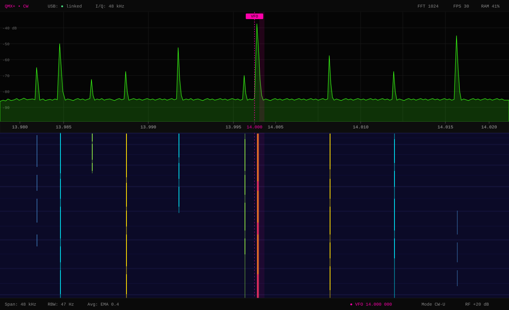
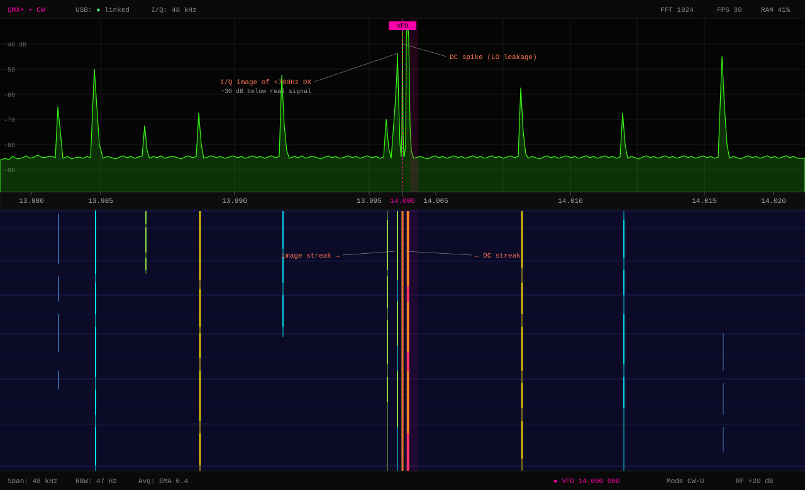

# Panadapter display — design targets and realistic appearance

This document captures the design intent for the Tab5 panadapter's visual output, together with the hardware artifacts you can expect to see in practice. The two mockups below show the same scenario — QMX+ tuned to **14.000 MHz** in **CW-U** mode with busy CW activity below and above center — first as an idealized rendering, then with the real-world quirks of a direct-conversion SDR added in.

## Scenario

- **VFO:** 14.000 MHz
- **Mode:** CW-U (700 Hz audio tone offset above VFO)
- **Span:** 48 kHz (±24 kHz around VFO, the full I/Q bandwidth from the QMX)
- **FFT:** 1024-pt complex, Blackman-Harris window
- **Resolution bandwidth:** ~47 Hz/bin
- **Render:** 30 FPS, EMA smoothing α=0.4, autoscale once per second

## 1. Ideal display

This is what we are aiming for. The green trace at the top is the live spectrum; the dark-blue field below is the waterfall (newest line at the top, scrolling down). Each vertical streak in the waterfall is a CW station — gaps in the streak are the spaces between dits and dahs.

The magenta dashed line is the VFO at 14.000 MHz. The shaded magenta band just to its right is the ~500 Hz CW filter passband centered at +700 Hz — the audio actually being demodulated. The loud red station sits exactly in that passband; that is the operator the user is listening to.

Color in the waterfall encodes signal strength relative to the autoscaled noise floor: dark blue is noise, cyan is weak, yellow is solid, red is strong.

## 2. Realistic display — with hardware artifacts

Same scenario, but with two unavoidable artifacts of a direct-conversion SDR front end. Both are annotated in salmon.

### The DC spike (on the VFO line)

A Quadrature Sampling Detector mixes the antenna signal with the local oscillator. No mixer is perfect: a small amount of LO leaks straight through to the I/Q baseband output, where it appears as a DC offset. After the FFT, DC sits at bin N/2 — exactly your VFO frequency. Small DC biases in the ADC and op-amps contribute too. The result is a permanent narrow spike that never goes away regardless of what is on the antenna.

This is physics, not a bug — every direct-conversion SDR shows it (HackRF, RTL-SDR in direct sampling, the QMX, the QuantumSDR M4). Typical width is 1–3 bins, around ±50–150 Hz given our 47 Hz/bin resolution. Blackman-Harris windowing spreads it slightly wider than a rectangular window would, in exchange for much cleaner sidelobes elsewhere — the right trade.

**Mitigation options, in order of complexity:**

| Approach | Cost | Trade-off |
|---|---|---|
| Leave it visible | Free | Honest, but ugly. Hides any real signal exactly on VFO. |
| Mask the center 3 bins (force them to noise floor) | Trivial | Loses any real signal within ±150 Hz of VFO. For CW this does not matter — the listening point is +700 Hz offset. |
| Interpolate across (replace center bins with the average of neighbors) | Cheap | Visually clean; eye does not notice the gap. |
| Time-domain DC block (subtract a running mean from I and Q before the FFT) | Slightly more CPU | Removes the spike at source. Standard SDR technique. |

Plan: start with a 3-bin mask for v1; revisit with a running-mean DC block as a DSP exercise later.

### The I/Q image (mirror at x=632)

For an FFT to cleanly separate positive from negative frequencies, the I and Q channels must be perfectly equal in amplitude and exactly 90° apart in phase. In real hardware the QSD transformer, sampling capacitors, op-amps, and ADC channels are *almost* matched but not quite. A strong signal at +ΔF leaves a faint copy at −ΔF — a ghost of the real signal, mirrored across the VFO.

Typical image rejection for QMX-class hardware: **30–40 dB** on the lower HF bands, getting worse on 20 m and above. The QMX operating manual flags this directly in §8.6.7 of `operation_1_03_002`: *"On higher frequencies (20m and above) the sinewaves get increasingly noisy and this is normal."* The "noise" is largely I/Q imbalance.

So a +30 over S9 DX station shows a ghost twin mirrored across the VFO at roughly S3–S5 level — strong enough to look like a real station, weak enough that the mirror geometry is a giveaway.

**Mitigation options:**

| Approach | Cost | Trade-off |
|---|---|---|
| Leave it visible | Free | Educational, useful for bring-up diagnostics. |
| Static IQ balance correction (per-band amplitude + phase coefficients applied before the FFT) | Moderate | Can push rejection to 50–60 dB. Needs one-time calibration per band. |
| Adaptive IQ balance correction | Hard | Tracks drift; what high-end SDRs do. |

Plan: leave images visible in v1 — they are useful diagnostic content. The mirror symmetry itself is a free sanity check: if real signals ever appear on the wrong side of VFO, the I and Q channels are swapped and need to be exchanged in the UAC ingestion path. Add IQ balance correction as a Phase 5 or 6 polish item.

## What this means for first bring-up

When raw UAC samples first reach the FFT, expect to see:

1. **A vertical magenta streak on the VFO line.** That is the DC spike, and it confirms the FFT is running and the `fftshift` (or equivalent) is correctly centering DC at bin N/2.
2. **Mirror symmetry of real signals around DC if I and Q are swapped.** If CW activity appears reflected (signals that should be above the band edge showing up below it), exchange channels at the UAC input.
3. **Faint ghosts of strong signals across the VFO.** That is the image, around 30 dB down. Normal.
4. **A perfectly symmetric spectrum** — every signal mirrored at equal amplitude — means both stereo channels are receiving the same data (e.g., both connected to L, or the Q channel is silent). The FFT cannot then distinguish positive from negative frequencies.

## Open numbers to verify

- **Image rejection** is estimated at ~30 dB based on the manual's tone and typical QSD-based SDR performance. The actual figure for our specific QMX+ unit could be anywhere from 20 dB to 45 dB depending on band and assembly variation. Worth measuring once signal is flowing: inject a single tone slightly above VFO, measure the ghost amplitude below.
- **DC spike width** is given here as 3 bins for Blackman-Harris. The true width depends on the exact window function chosen and any residual DC drift in the ADC path.

## References

- QRP Labs, *QMX operating manual, firmware 1_03_002*, §5.22 (receiver signal path) and §8.6.7 (Test ADC I/Q diagnostic).
- QRP Labs, *QMX CAT programming manual, firmware 1_03_000*, Q9 command (IQ Mode enable/disable).
- See also `docs/architecture.md` for the overall signal path from QMX USB to the Tab5 display.
